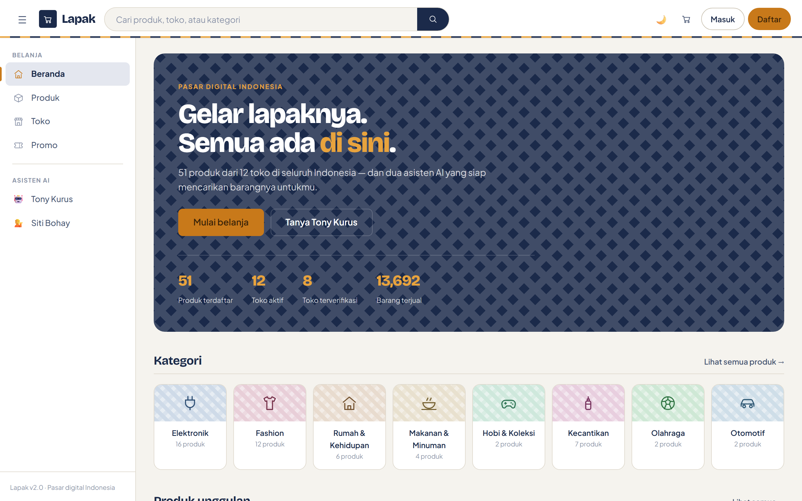
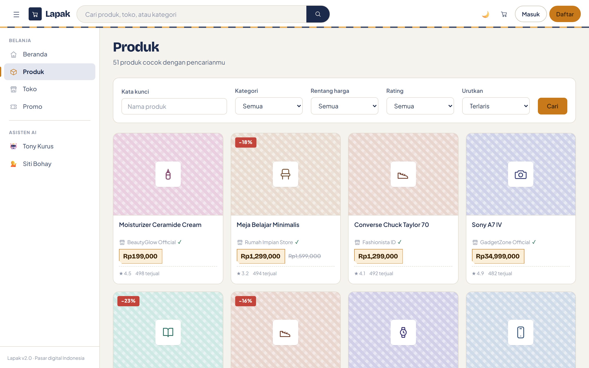
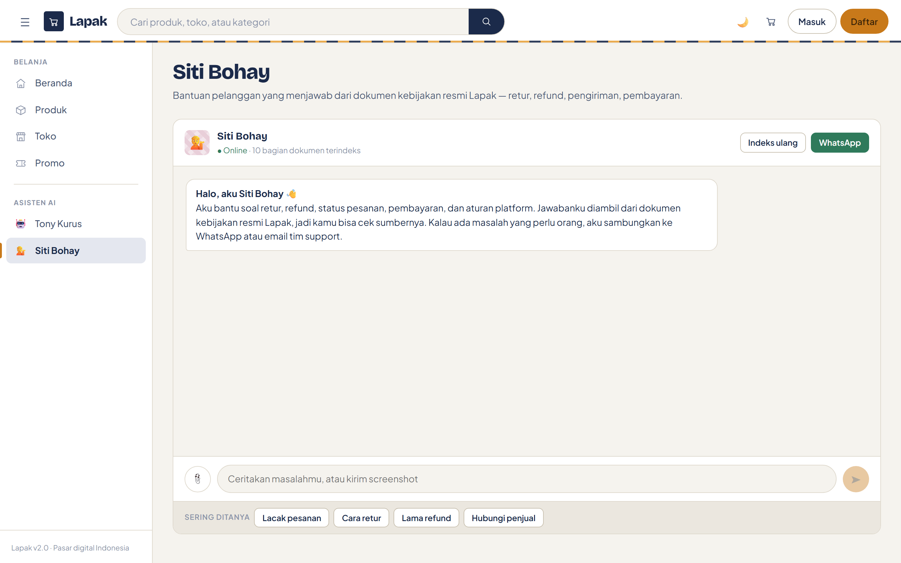
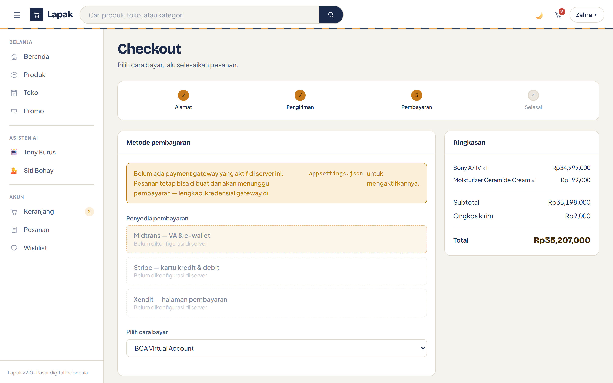
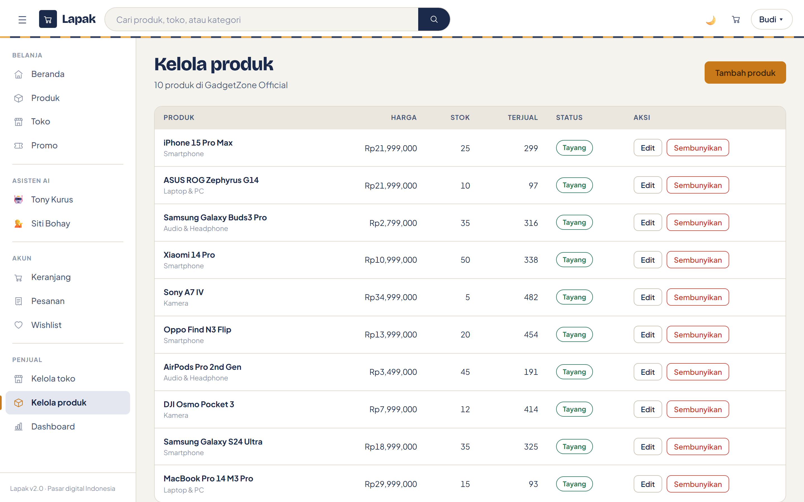
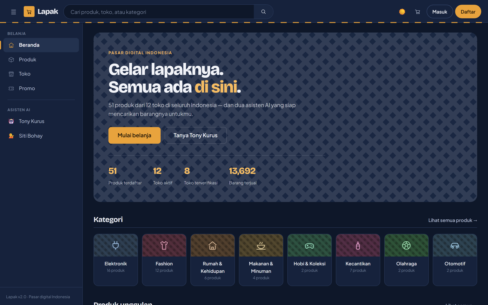
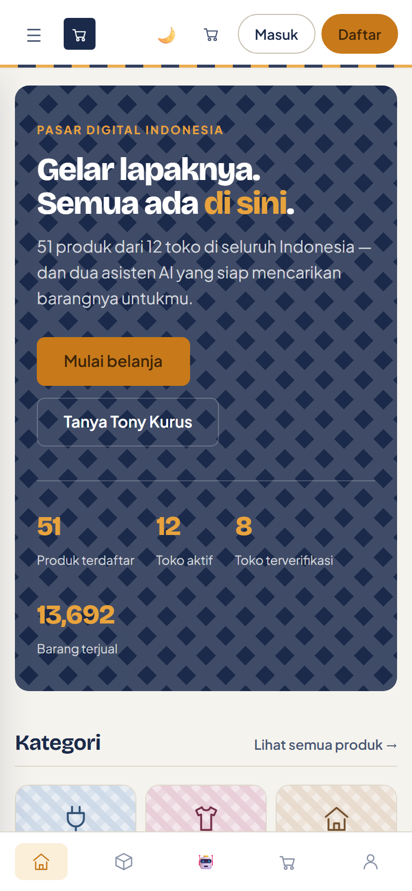

# 🧺 Lapak

> Pasar digital Indonesia berbasis .NET 10 Blazor Server, dengan dua asisten AI
> yang membaca katalog langsung — bukan menebak.

*Lapak* adalah tikar anyaman yang digelar pedagang di pasar. Seluruh tampilannya
dibangun dari gagasan itu: nila dan kunyit dari pewarna batik, garis tenda pasar di
bawah header, dan pola anyaman sebagai pengganti foto produk.



---

## Mulai cepat

```bash
git clone https://github.com/yourusername/lapak.git
cd lapak
dotnet run
```

Buka <https://localhost:7205>. SQLite dipakai secara bawaan, jadi tidak ada yang
perlu disiapkan — database dibuat dan diisi otomatis saat pertama dijalankan:
30 pengguna, 12 toko, 51 produk, dan 30 pesanan.

**Prasyarat:** .NET 10 SDK.

### Akun demo

Semua akun contoh memakai password **`Lapak2025!`**.

| Peran | Email | Yang bisa diakses |
|---|---|---|
| Pembeli | `zahra.aulia@lapak.com` | Keranjang, checkout, pesanan, wishlist |
| Penjual | `budi.santoso@lapak.com` | Kelola toko dan produk, dashboard penjualan |
| Admin | `admin.lapak@lapak.com` | Panel admin, verifikasi toko, voucher |

Kredensial ini hanya ada di data contoh. Akun asli dibuat lewat `/account/register`.

---

## Isinya apa saja

### Etalase

Pencarian produk dengan filter kategori, harga, rating, dan pengurutan. Halaman
produk dan toko lengkap dengan ulasan, wishlist, dan keranjang. Checkout tiga
langkah yang menghitung ongkos kirim sebelum meminta pembayaran.



### Dua asisten AI

**Tony Kurus** adalah asisten belanja. Ia punya delapan tool Semantic Kernel yang
tersambung ke database — cari produk dengan filter, cari toko, detail produk, promo
aktif, cek pesanan, waktu, dan kalkulasi — jadi jawabannya berasal dari katalog,
bukan ingatan model.

**Siti Bohay** menangani bantuan pelanggan. Jawabannya diambil dari dokumen kebijakan
di folder `Documents/` lewat indeks TF-IDF, dan setiap balasan bisa menampilkan
kutipan sumbernya. Kalau tidak bisa diselesaikan, ia mengalihkan ke WhatsApp atau email.



Keduanya menerima unggahan gambar, membalas secara streaming, dan berpindah
penyedia otomatis (OpenAI → Gemini → Anthropic → Ollama) saat satu penyedia gagal.

### Pembayaran — Midtrans, Xendit, dan Stripe

Setiap gateway adalah satu `IPaymentProvider`; pembeli memilih sendiri di checkout,
dan gateway yang belum dikonfigurasi tampil nonaktif. Tanda tangan webhook
diverifikasi untuk ketiganya — SHA-512 untuk Midtrans, callback token untuk Xendit,
HMAC-SHA256 bertimestamp untuk Stripe.



Lihat [docs/payments.md](docs/payments.md) untuk konfigurasi dan pengujian webhook.

### Pengiriman

Integrasi RajaOngkir dengan tujuh kurir (JNE, J&T, SiCepat, Pos Indonesia,
AnterAja, Ninja, Lion), masing-masing tiga level layanan, plus pelacakan. Kalau API
key belum diisi, ongkir disimulasikan supaya checkout tetap jalan.

### Dashboard dan laporan

Pendapatan, jumlah pesanan, dan segmentasi pelanggan — semuanya bisa disaring
berdasarkan rentang tanggal, tier, dan status. Grafiknya memakai jumlah pesanan
harian yang sebenarnya, dan tombol **Unduh CSV** mengekspor persis apa yang sedang
tersaring.


### Perkakas penjual dan admin

Penjual mengelola profil toko dan katalog produknya. Admin memverifikasi toko,
membuat voucher dan kategori, serta melihat total platform. Kedua area dijaga
kebijakan peran, bukan sekadar menu yang disembunyikan.



### Terang dan gelap

Tema mengikuti preferensi sistem, bisa diganti manual, dan diingat antar kunjungan.



### Responsif



---

## Konfigurasi

Semuanya diatur lewat `appsettings.json`.

| Seksi | Fungsi |
|---|---|
| `DatabaseProvider` | `SQLite` (bawaan), `SqlServer`, `MySql`, `PostgreSql` |
| `AI` | API key LLM, urutan fallback, prompt chatbot |
| `VectorDatabase` | Folder dokumen RAG, ukuran chunk, interval indeks ulang |
| `PaymentGateways` | Kredensial Midtrans, Xendit, dan Stripe |
| `Shipping` | API key RajaOngkir, daftar kurir, kota asal |
| `Storage` | File system, MinIO, S3, atau Azure Blob |
| `CustomerScoring` | Ambang tier dan bobot skor |
| `RecommendationEngine` | Bobot collaborative dan content-based |

**Jangan pernah commit kredensial asli.** Pakai user-secrets saat development:

```bash
dotnet user-secrets set "AI:Providers:OpenAI:ApiKey" "sk-..."
dotnet user-secrets set "PaymentGateways:Stripe:SecretKey" "sk_test_..."
```

atau environment variable di production (`AI__Providers__OpenAI__ApiKey`).

---

## Struktur proyek

```
Lapak/
├── Components/
│   ├── Layout/MainLayout.razor      # kerangka: nav, sidebar, tema, badge keranjang
│   ├── Pages/                       # semua rute
│   └── Shared/ProductCard.razor     # kartu anyaman + label harga bertakik
├── Controllers/
│   ├── AccountController.cs         # login, daftar, keluar, refresh klaim
│   ├── ApiControllers.cs            # unggahan, webhook pembayaran
│   └── ReportsController.cs         # ekspor CSV
├── Data/                            # DbContext dan data contoh
├── Documents/                       # dokumen sumber untuk RAG
├── Hubs/ChatHub.cs                  # SignalR: chat, notifikasi, dashboard
├── Models/
│   ├── Configurations/AppConfigs.cs # semua POCO konfigurasi
│   └── …                            # 15 entitas berbasis EntityBase
├── Services/
│   ├── SemanticKernel/              # kernel + 9 tool, fallback multi-provider
│   ├── Rag/                         # indeks TF-IDF + pengindeks latar belakang
│   ├── Payment/                     # kontrak + 3 provider gateway
│   ├── Shipping/                    # RajaOngkir + 7 kurir
│   ├── Storage/                     # file system / MinIO lewat factory
│   ├── RecommendationService.cs     # collaborative + content-based
│   └── CustomerScoringService.cs    # Bronze / Silver / Gold / Platinum
├── wwwroot/app.css                  # seluruh design system
└── docs/                            # dokumentasi dan tangkapan layar
```

---

## Dokumentasi

- [Arsitektur](docs/architecture.md)
- [Payment gateway](docs/payments.md)
- [Konfigurasi AI](docs/ai-config.md)
- [Dashboard dan laporan](docs/dashboard.md)
- [Setup database](docs/database.md)
- [Setup storage](docs/storage.md)
- [Galeri tangkapan layar](docs/screenshots.md)

---

## Teknologi

.NET 10 Blazor Server · Entity Framework Core · ASP.NET Identity · SignalR ·
Microsoft Semantic Kernel · MinIO SDK · Polly

## Catatan

Skema dibuat dengan `EnsureCreated()`, bukan migration. Kalau kamu mengubah entitas,
hapus `lapak.db*` lalu jalankan ulang supaya database dibuat kembali.

## Lisensi

MIT — lihat LICENSE.

---

*English: [README.md](README.md)*

Dibuat dengan ❤️ oleh Jacky The Code Bender @ Gravicode Studios
