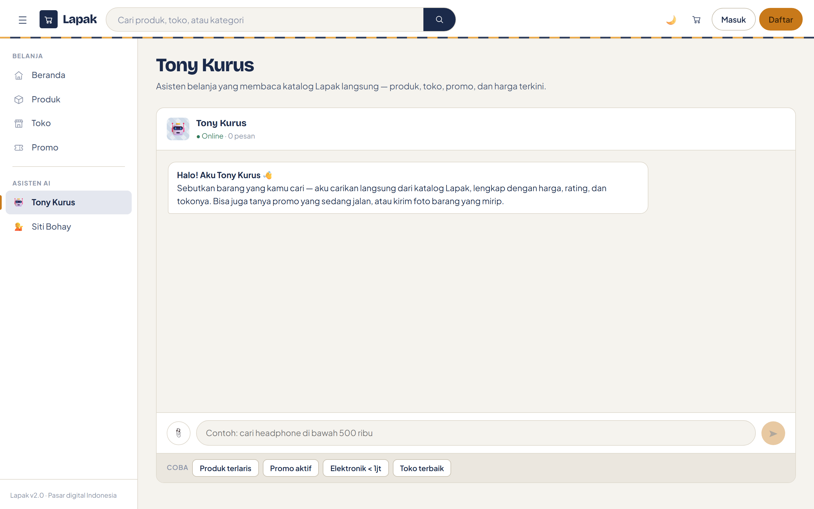

# 🤖 Konfigurasi AI — Lapak

Lapak punya dua asisten yang dibangun di atas **Microsoft Semantic Kernel**:

| Asisten | Rute | Tugas |
|---|---|---|
| Tony Kurus | `/chat/tony-kurus` | Asisten belanja — cari produk, toko, promo |
| Siti Bohay | `/chat/siti-bohay` | Bantuan pelanggan — retur, refund, kebijakan |



---

## Provider

Semua provider dipanggil lewat permukaan yang kompatibel-OpenAI
(`AddOpenAIChatCompletion` dengan `BaseUrl` masing-masing).

| Provider | Model bawaan | Endpoint |
|---|---|---|
| OpenAI | `gpt-4o-mini` | `https://api.openai.com/v1` |
| Gemini | `gemini-1.5-flash` | `https://generativelanguage.googleapis.com/v1beta` |
| Anthropic | `claude-3-haiku-20240307` | `https://api.anthropic.com` |
| Ollama | `llama3` | `http://localhost:11434` |

Provider apa pun yang menyediakan endpoint kompatibel-OpenAI bisa ditambahkan
dengan menambah entri baru di `AI:Providers`.

### Fallback

Urutannya dimulai dari `DefaultProvider`, lalu menyusul
`OpenAI → Gemini → Anthropic → Ollama`. Bila satu provider gagal, permintaan
diulang ke provider berikutnya. Dengan `FallbackEnabled: false`, hanya provider
default yang dicoba.

Kalau semuanya gagal, asisten membalas dengan pesan yang jujur, bukan melempar
error ke layar.

---

## Konfigurasi

```json
{
  "AI": {
    "DefaultProvider": "OpenAI",
    "FallbackEnabled": true,
    "EmbeddingProvider": "OpenAI",
    "EmbeddingModel": "text-embedding-3-small",

    "Providers": {
      "OpenAI": {
        "ApiKey": "",
        "Model": "gpt-4o-mini",
        "BaseUrl": "https://api.openai.com/v1",
        "MaxTokens": 2000,
        "Temperature": 0.7,
        "TimeoutSeconds": 60
      },
      "Ollama": {
        "ApiKey": "",
        "Model": "llama3",
        "BaseUrl": "http://localhost:11434/v1",
        "TimeoutSeconds": 120
      }
    },

    "ChatBots": {
      "TonyKurus": {
        "Name": "Tony Kurus",
        "SystemPrompt": "Kamu adalah Tony Kurus, asisten belanja…",
        "Temperature": 0.8,
        "MaxTokens": 2000
      },
      "SitiBohay": {
        "Name": "Siti Bohay",
        "SystemPrompt": "Kamu adalah Siti Bohay, customer support…",
        "Temperature": 0.6,
        "MaxTokens": 2000
      }
    }
  }
}
```

> **Jangan commit API key.** Pakai user-secrets saat development:
> ```bash
> dotnet user-secrets set "AI:Providers:OpenAI:ApiKey" "sk-..."
> ```
> atau environment variable di server: `AI__Providers__OpenAI__ApiKey`.

**Mengubah persona chatbot adalah perubahan konfigurasi, bukan kode.** Nama, system
prompt, temperature, dan max token seluruhnya dibaca dari `AI:ChatBots` saat runtime.

---

## Tools

`ToolCallBehavior.AutoInvokeKernelFunctions` aktif, jadi model memanggil tool
sendiri saat dibutuhkan. Deskripsi tool ditulis dalam bahasa Indonesia karena
model-lah yang membacanya untuk memutuskan kapan memanggil.

| Tool | Fungsi |
|---|---|
| `search_products` | Cari produk: kata kunci, kategori, rentang harga, rating, urutan |
| `get_product_detail` | Detail satu produk berdasarkan slug atau nama |
| `get_promos` | Promo produk dan voucher yang sedang aktif |
| `search_stores` | Cari toko: nama, kota, rating, status verifikasi |
| `check_order_status` | Status pesanan, pembayaran, dan riwayat pelacakan |
| `search_knowledge_base` | Cari di dokumen kebijakan lewat indeks TF-IDF |
| `get_current_time` | Waktu sekarang dalam UTC dan WIB |
| `calculate` | Kalkulasi aritmetika |
| `search_internet` | Simulasi — mengarahkan kembali ke pencarian katalog |

Semua pencarian teks **tidak** peka huruf besar-kecil.

### Menambah tool

Tambahkan satu method di salah satu kelas plugin dalam
`Services/SemanticKernel/SkChatService.cs`:

```csharp
[KernelFunction("nama_tool")]
[Description("Penjelasan singkat yang dibaca model untuk memutuskan kapan memanggil ini.")]
public async Task<string> NamaTool(
    [Description("Penjelasan parameter")] string parameter)
{
    // …
}
```

Pendaftarannya lewat `builder.Plugins.AddFromType<T>()` yang sudah ada — tidak ada
wiring lain yang perlu disentuh.

---

## RAG untuk Siti Bohay


Siti Bohay menjawab dari dokumen di folder `Documents/`. Alurnya:

```
Pertanyaan pelanggan
   → VectorRagService.SearchAsync (TF-IDF, top 3)
   → kutipan disisipkan ke prompt bersama pertanyaan
   → SkChatService.ChatStreamAsync
   → balasan + panel "Sumber dari dokumen kebijakan" yang bisa dibuka
```

Menampilkan sumbernya disengaja: pelanggan bisa memeriksa dasar jawabannya, dan
kamu bisa melihat kalau retrieval-nya meleset.

### Konfigurasi

```json
"VectorDatabase": {
  "Provider": "InMemory",
  "DocumentFolderPath": "Documents",
  "ReindexIntervalMinutes": 30,
  "ChunkSize": 1000,
  "ChunkOverlap": 200
}
```

Format yang diindeks: `.txt`, `.md`, `.csv`, `.html`, `.json`.

Indeks dibangun ulang otomatis tiap `ReindexIntervalMinutes` oleh
`VectorIndexingBackgroundService`, dan bisa dipicu manual lewat tombol **Indeks
ulang** di halaman chat.

`ChunkOverlap` membuat ekor tiap potongan dibawa ke potongan berikutnya, sehingga
jawaban yang terpotong di batas chunk masih bisa ditemukan utuh.

> Provider `Sqlite`, `PostgreSql`, `Qdrant`, dan `Filesystem` sudah ada di skema
> konfigurasi tetapi belum diimplementasikan. Yang berjalan adalah `InMemory`.

---

## Unggah gambar

Kedua asisten menerima gambar. Berkas diunggah lewat `StorageServiceFactory`, lalu
URL publiknya dikirim ke model sebagai `ImageContent`. Batasnya 10 MB.

Dukungan gambar bergantung pada model yang dipakai — `gpt-4o-mini` bisa, model teks
saja tidak.

---

## Streaming

`ChatStreamAsync` mengumpulkan seluruh respons satu provider sebelum menyerahkannya
ke UI. Itu disengaja: kalau provider gagal di tengah jalan, fallback masih bisa
mengambil alih tanpa pengguna melihat jawaban setengah jadi.
