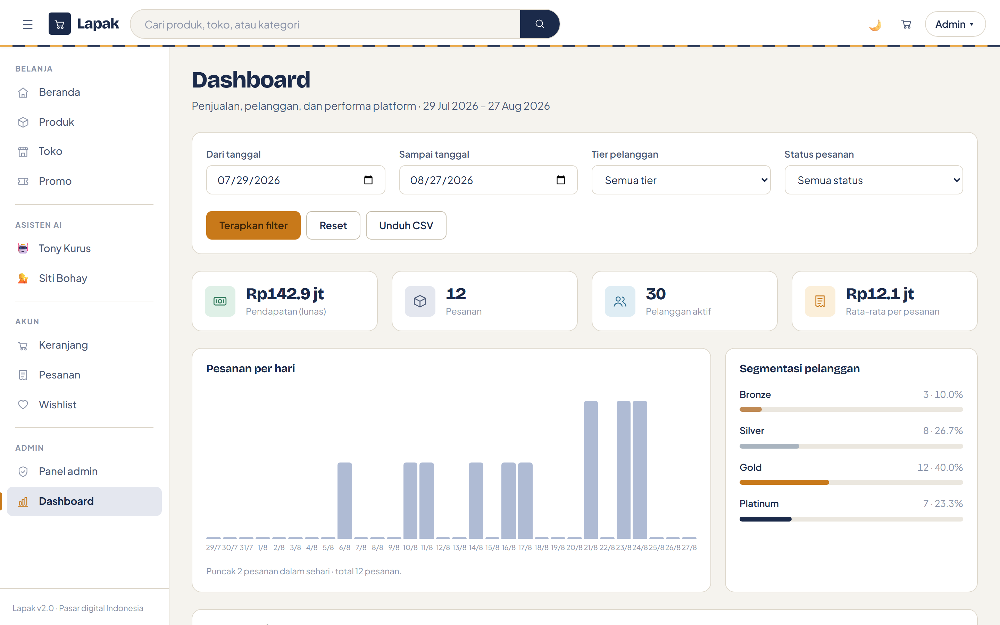
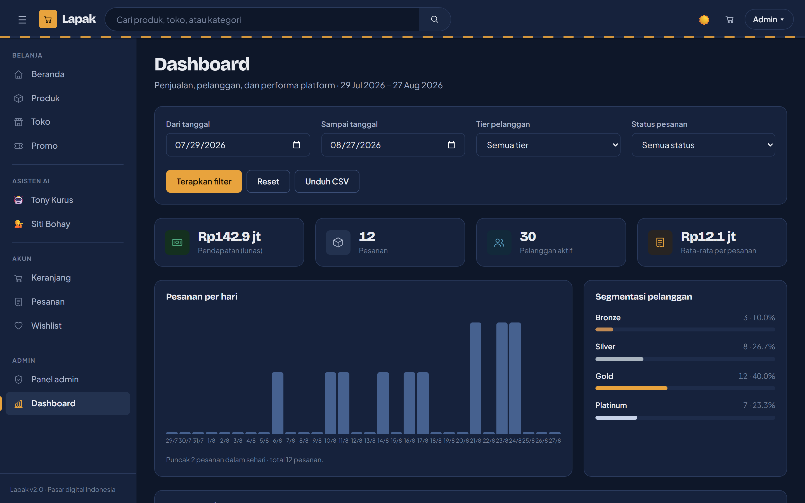

# 📊 Dashboard & Laporan — Lapak

Rute: `/dashboard` — terbuka untuk pengguna yang sudah masuk; tautannya muncul di
sidebar untuk penjual dan admin.



---

## Filter menentukan segalanya

Filter berada di paling atas karena **seluruh isi halaman mengikutinya** — kartu
statistik, grafik, dan tabel semuanya dihitung ulang dari kueri yang sama.

| Filter | Perilaku |
|---|---|
| Dari / sampai tanggal | Inklusif di kedua ujung; bawaannya 30 hari terakhir |
| Tier pelanggan | Menyaring pesanan berdasarkan tier pemiliknya |
| Status pesanan | Pending, Paid, Processing, Shipped, Delivered, Completed, Cancelled |

Tombol **Reset** mengembalikan ke rentang 30 hari tanpa filter lain.

---

## Kartu statistik

| Kartu | Yang dihitung |
|---|---|
| Pendapatan (lunas) | Jumlah `GrandTotal` pesanan yang `PaymentStatus = Paid` atau `Status = Completed` |
| Pesanan | Jumlah pesanan dalam rentang, apa pun statusnya |
| Pelanggan aktif | Pengguna `IsActive`, ikut tersaring bila tier dipilih |
| Rata-rata per pesanan | Total nilai pesanan dibagi jumlah pesanan |

Nilai rupiah diringkas (`rb` / `jt` / `M`) supaya kartu tetap terbaca; angka
lengkapnya ada di tabel dan di CSV.

Pendapatan sengaja hanya menghitung uang yang benar-benar diterima — pesanan yang
dibuat tapi belum dibayar tidak masuk hitungan.

---

## Grafik

**Pesanan per hari** memplot jumlah pesanan harian yang sebenarnya, dikelompokkan
di database (`GROUP BY CreatedAt.Date`), lalu diisi nol untuk hari tanpa pesanan
supaya sumbu waktunya tidak bolong. Rentang lebih dari 60 hari dipotong agar batang
tetap terbaca.

**Segmentasi pelanggan** memakai `ICustomerScoringService.GetTierDistributionAsync()`
dan menampilkan jumlah serta persentase tiap tier.

Grafik digambar dengan CSS grid dan flexbox, bukan pustaka chart — tidak ada
JavaScript yang perlu dimuat, dan warnanya otomatis ikut tema terang/gelap.



---

## Tabel pesanan terbaru

12 pesanan terakhir dalam rentang, lengkap dengan nama pelanggan, tier, dan toko.
Nomor pesanan menautkan ke halaman detailnya.

---

## Ekspor CSV

Tombol **Unduh CSV** mengarah ke `GET /api/reports/orders.csv` dengan filter yang
sedang aktif diteruskan sebagai query string:

```
/api/reports/orders.csv?from=2026-07-29&to=2026-08-27&tier=Gold&status=Completed
```

Endpoint memakai kueri yang sama dengan halaman, jadi **berkasnya selalu cocok
dengan apa yang terlihat di layar**. Batas amannya 5.000 baris per unduhan.

Kolom: nomor pesanan, tanggal, pelanggan, email, tier, toko, subtotal, ongkir,
diskon, total, status, status bayar, gateway, kurir, resi.

Berkas ditulis dengan BOM UTF-8 supaya Excel di Windows membaca teks Indonesianya
dengan benar, dan setiap kolom dikutip sehingga koma di dalam nama tidak menggeser
kolom.

Endpoint ini `[Authorize]` — unduhan hanya untuk pengguna yang sudah masuk.

---

## Segmentasi pelanggan

Tier dihitung `CustomerScoringService` dari jumlah transaksi, nilai transaksi, dan
keragaman kategori, dengan bobot yang diatur di `appsettings.json`:

```json
"CustomerScoring": {
  "BronzeThreshold": 0,
  "SilverThreshold": 100,
  "GoldThreshold": 500,
  "PlatinumThreshold": 1000,
  "TransactionCountWeight": 0.3,
  "TransactionValueWeight": 0.5,
  "CategoryDiversityWeight": 0.2
}
```

| Tier | Skor |
|---|---|
| Bronze | 0 – 99 |
| Silver | 100 – 499 |
| Gold | 500 – 999 |
| Platinum | 1000+ |

---

## Catatan

`DashboardHub` (`/hubs/dashboard`) sudah terpasang dan siap dipakai untuk mendorong
pembaruan langsung ke klien, tetapi halaman dashboard saat ini memuat datanya lewat
kueri biasa saat dibuka dan saat filter diterapkan.
