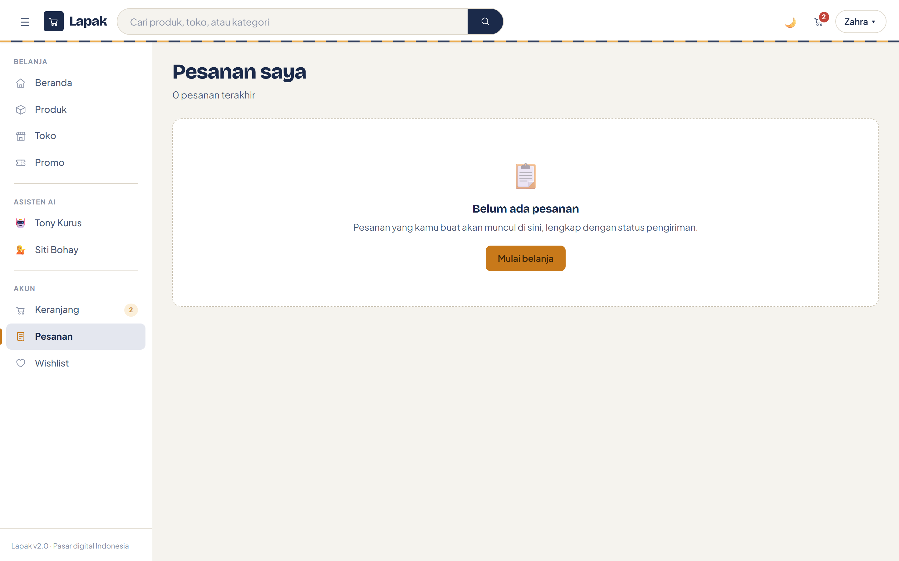

# 💳 Payment Gateway — Lapak

Lapak mendukung tiga penyedia pembayaran: **Midtrans**, **Xendit**, dan **Stripe**.
Pembeli memilih penyedianya sendiri di langkah pembayaran; gateway yang belum
dikonfigurasi di server tampil sebagai nonaktif dan tidak bisa dipilih.


---

## Arsitektur

Setiap gateway adalah satu implementasi `IPaymentProvider`:

```
Services/Payment/
├── PaymentContracts.cs          # DTO, PaymentState, IPaymentProvider
├── PaymentService.cs            # router + pembukuan Order
├── MidtransPaymentProvider.cs
├── XenditPaymentProvider.cs
└── StripePaymentProvider.cs
```

`PaymentService` menerima seluruh provider lewat DI (`IEnumerable<IPaymentProvider>`),
lalu memilih satu berdasarkan `PaymentRequest.Gateway`. Provider hanya mengurus
protokol masing-masing; **pembaruan status pesanan dilakukan di satu tempat**, yaitu
`PaymentService.ApplyState`, sehingga ketiga gateway menggerakkan order melalui
transisi yang persis sama.

Semua gateway memetakan kosakata mereka sendiri ke satu enum:

| `PaymentState` | Midtrans | Xendit | Stripe |
|---|---|---|---|
| `Paid` | `settlement`, `capture` | `PAID`, `SETTLED` | `payment_status=paid` |
| `Pending` | `pending` | `PENDING` | `unpaid` |
| `Failed` | `deny`, `cancel`, `failure` | `FAILED` | `async_payment_failed` |
| `Expired` | `expire` | `EXPIRED` | `checkout.session.expired` |
| `Refunded` | `refund`, `partial_refund` | — | `charge.refunded` |

### Menambah gateway baru

1. Buat kelas yang mengimplementasikan `IPaymentProvider`.
2. Daftarkan satu baris di `Program.cs`:
   ```csharp
   builder.Services.AddScoped<IPaymentProvider, GatewayBaruProvider>();
   ```
3. Tambahkan endpoint callback di `PaymentController` bila gateway mengirim webhook.

Tidak ada `switch` yang perlu disentuh — halaman checkout membaca daftar gateway
lewat `IPaymentService.GetAvailableGateways()`.

---

## Konfigurasi

Semua kredensial berada di `appsettings.json` pada seksi `PaymentGateways`.

```json
{
  "PaymentGateways": {
    "DefaultGateway": "Midtrans",
    "PublicBaseUrl": "https://localhost:7205",

    "Midtrans": {
      "Enabled": true,
      "ServerKey": "SB-Mid-server-xxxxx",
      "ClientKey": "SB-Mid-client-xxxxx",
      "IsProduction": false,
      "CallbackUrl": "https://domainmu.com/api/payment/midtrans-callback"
    },

    "Xendit": {
      "Enabled": true,
      "ApiKey": "xnd_development_xxxxx",
      "CallbackToken": "token-dari-dashboard-xendit",
      "BaseUrl": "https://api.xendit.co",
      "IsProduction": false,
      "CallbackUrl": "https://domainmu.com/api/payment/xendit-callback"
    },

    "Stripe": {
      "Enabled": true,
      "SecretKey": "sk_test_xxxxx",
      "PublishableKey": "pk_test_xxxxx",
      "WebhookSecret": "whsec_xxxxx",
      "Currency": "idr",
      "IsProduction": false,
      "CallbackUrl": "https://domainmu.com/api/payment/stripe-callback"
    }
  }
}
```

> **`PublicBaseUrl` wajib berupa URL absolut yang bisa dijangkau dari internet.**
> Xendit dan Stripe menolak URL relatif untuk redirect setelah pembayaran.

> **Jangan menaruh kredensial asli di `appsettings.json` yang ikut ter-commit.**
> Pakai user-secrets saat development (`dotnet user-secrets set "PaymentGateways:Stripe:SecretKey" "sk_test_..."`)
> atau environment variable di server (`PaymentGateways__Stripe__SecretKey`).

`Enabled: false` menyembunyikan gateway dari checkout tanpa menghapus konfigurasinya.

---

## Midtrans

Memakai **Core API** (`/v2/charge`). Transfer bank menghasilkan nomor Virtual
Account yang ditampilkan langsung di halaman konfirmasi; e-wallet menghasilkan
deeplink.

**Cara bayar yang tersedia**

| Kode | Tampilan |
|---|---|
| `bank_transfer:bca` | BCA Virtual Account |
| `bank_transfer:bni` | BNI Virtual Account |
| `bank_transfer:bri` | BRI Virtual Account |
| `echannel:mandiri` | Mandiri Bill Payment |
| `gopay:gopay` | GoPay |
| `qris:qris` | QRIS |

**Keamanan callback.** Midtrans menandatangani notifikasi dengan SHA-512 atas
`order_id + status_code + gross_amount + ServerKey`. Provider menghitung ulang
tanda tangan itu dan membandingkannya dengan `CryptographicOperations.FixedTimeEquals`.
Callback dengan tanda tangan yang tidak cocok dijawab **401**, bukan 200.

Pembayaran kartu berstatus `capture` dengan `fraud_status = challenge` sengaja
tetap dianggap `Pending` sampai review selesai.

**Konsistensi jumlah.** Midtrans menolak transaksi bila `item_details` tidak
berjumlah sama dengan `gross_amount`, jadi ongkos kirim dan diskon voucher ikut
dikirim sebagai baris tersendiri.

Daftarkan URL notifikasi di dashboard Midtrans:
`https://domainmu.com/api/payment/midtrans-callback`

---

## Xendit

Memakai **Invoice API** (`/v2/invoices`). Semua metode disalurkan lewat satu
halaman pembayaran, jadi pembeli diarahkan keluar dari Lapak lalu kembali ke
halaman pesanannya.

**Cara bayar yang tersedia:** BCA, BNI, BRI, dan Mandiri Virtual Account; OVO,
DANA, ShopeePay, dan QRIS.

**Keamanan callback.** Xendit mengirim header `x-callback-token` berisi token
statis dari dashboard. Provider membandingkannya secara constant-time dengan
`CallbackToken`. Kalau `CallbackToken` dikosongkan, verifikasi dilewati — **jangan
lakukan itu di production.**

Daftarkan URL webhook di dashboard Xendit:
`https://domainmu.com/api/payment/xendit-callback`

---

## Stripe

Memakai **Checkout Sessions** (`/v1/checkout/sessions`) lewat REST langsung,
tanpa SDK, supaya bentuknya konsisten dengan dua gateway lainnya.

**Cara bayar yang tersedia:** kartu kredit/debit, Alipay, WeChat Pay.

**Nol desimal.** IDR termasuk mata uang tanpa satuan kecil di Stripe, jadi
`unit_amount` dikirim sebagai rupiah utuh — bukan dikali 100. Daftar mata uang
zero-decimal ada di `StripePaymentProvider.ZeroDecimalCurrencies`.

**Diskon.** Stripe tidak menerima line item bernilai negatif. Pesanan yang memakai
voucher dikirim sebagai satu baris ringkasan senilai `GrandTotal`; rinciannya tetap
bisa dilihat di halaman pesanan.

**Keamanan webhook.** Header `Stripe-Signature` berbentuk `t=<timestamp>,v1=<signature>`.
Provider menghitung HMAC-SHA256 atas `"{timestamp}.{body}"` memakai `WebhookSecret`,
lalu membandingkannya constant-time. Signature yang lebih tua dari 5 menit ditolak
untuk mencegah replay.

Event yang ditangani:

| Event | Hasil |
|---|---|
| `checkout.session.completed` | `Paid` |
| `checkout.session.async_payment_succeeded` | `Paid` |
| `checkout.session.async_payment_failed` | `Failed` |
| `checkout.session.expired` | `Expired` |
| `charge.refunded` | `Refunded` |

Nomor pesanan Lapak dibawa lewat `client_reference_id` dan juga disalin ke
`metadata[order_number]`.

Daftarkan endpoint di dashboard Stripe:
`https://domainmu.com/api/payment/stripe-callback`

---

## Alur checkout

```
Keranjang
   ↓
Alamat pengiriman
   ↓
Pilih kurir & layanan  ──→  ShippingService (RajaOngkir / simulasi)
   ↓
Pilih gateway + cara bayar
   ↓
Voucher divalidasi DULU  ──→  kode tidak valid = pesanan tidak dibuat
   ↓
Order tersimpan (Pending / Unpaid), stok dikurangi
   ↓
PaymentService.CreatePaymentAsync
   ├─ VA number   → ditampilkan di halaman konfirmasi
   ├─ Payment URL → pembeli diarahkan ke gateway
   └─ gagal       → pesanan tetap ada, bisa dibayar dari halaman pesanan
   ↓
Webhook gateway  ──→  PaymentService.ProcessCallbackAsync  ──→  Order jadi Paid
```

Dua hal yang sengaja dibuat begitu:

- **Voucher divalidasi sebelum pesanan dibuat.** Kode yang salah menghasilkan pesan
  error, bukan pesanan dengan diskon nol.
- **Kegagalan gateway tidak membatalkan pesanan.** Order sudah tersimpan, dan
  tombol *Bayar sekarang* di halaman pesanan memulai ulang pembayaran.



---

## Menguji webhook secara lokal

Webhook butuh URL publik. Pakai terowongan seperti `ngrok`:

```bash
ngrok http 5247
# lalu set PublicBaseUrl dan CallbackUrl ke domain ngrok-nya
```

Untuk Stripe, CLI-nya bisa meneruskan event langsung:

```bash
stripe listen --forward-to localhost:5247/api/payment/stripe-callback
# salin whsec_... yang muncul ke PaymentGateways:Stripe:WebhookSecret
stripe trigger checkout.session.completed
```

Endpoint menjawab:

| Kode | Arti |
|---|---|
| `200` | Callback diterima dan status pesanan diperbarui |
| `401` | Signature atau token tidak valid — payload diabaikan |
| `400` | Payload tidak bisa dibaca, atau nomor pesanan tidak ditemukan |
