# 📸 Galeri Tangkapan Layar

Semua gambar di halaman ini diambil otomatis dari aplikasi yang berjalan dengan
data contoh bawaan — bukan mockup. Lihat [Cara memperbarui](#cara-memperbarui) di
bagian bawah.

---

## Etalase

### Beranda

Hero memakai pola anyaman — tikar yang menjadi asal nama Lapak — dengan angka
katalog yang dihitung langsung dari database.


### Beranda, tema gelap

Tema mengikuti preferensi sistem, bisa diganti lewat tombol bulan/matahari, dan
disimpan di browser.


### Daftar produk

Setiap kartu menganyam petak warnanya sendiri berdasarkan kategori, jadi katalog
tanpa foto tetap terbaca sebagai lapak yang beragam. Harga duduk di label bertakik
seperti kartu harga yang dijepit di barang dagangan.


### Detail produk

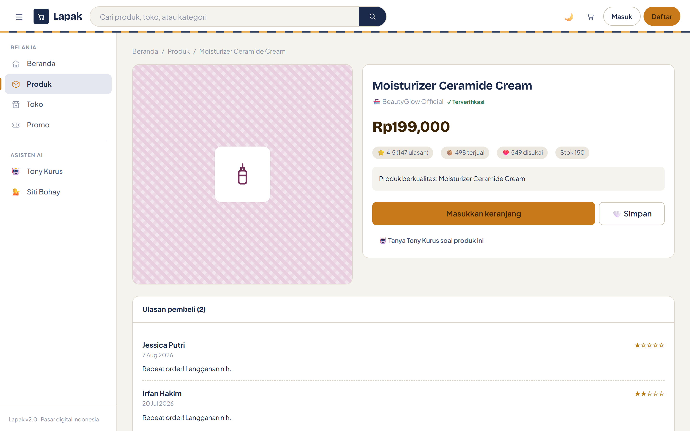

### Daftar toko

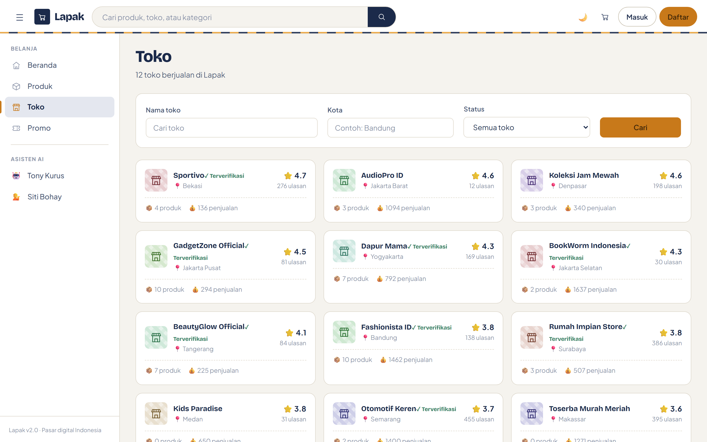

### Promo dan voucher

Voucher digambar sebagai kupon berperforasi, lengkap dengan sisa kuota.

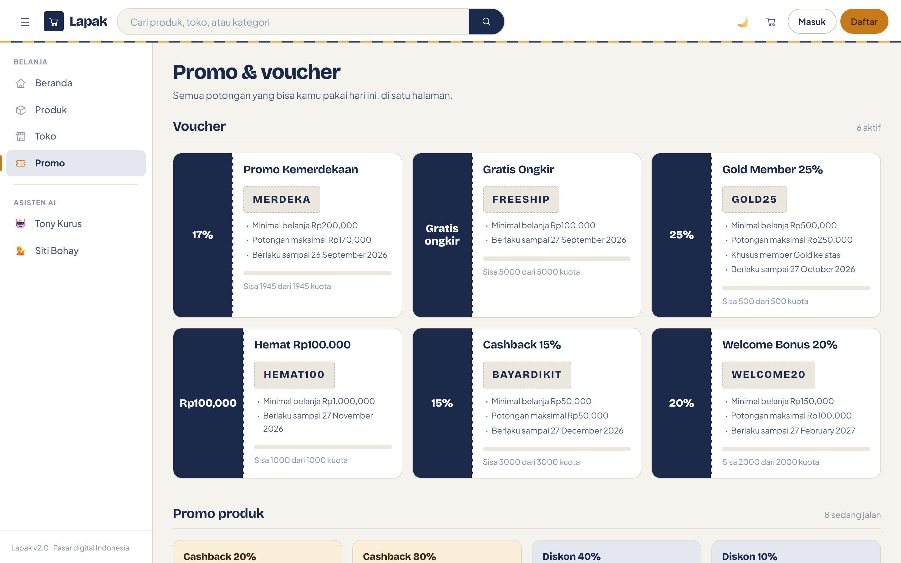

---

## Asisten AI

### Tony Kurus — asisten belanja

Delapan tool Semantic Kernel tersambung ke database, jadi jawabannya berasal dari
katalog yang sedang tayang.


### Siti Bohay — bantuan pelanggan

Jawaban diambil dari dokumen kebijakan lewat pencarian TF-IDF; tiap balasan bisa
membuka kutipan sumbernya.


---

## Belanja dan pembayaran

### Keranjang

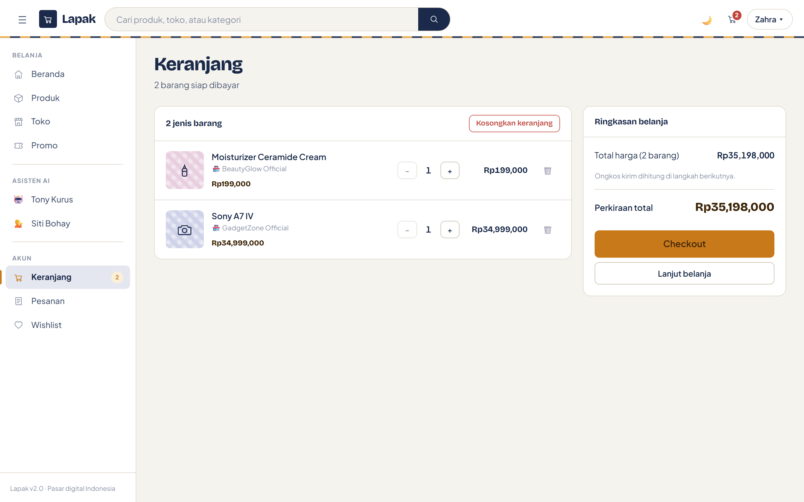

### Checkout — alamat

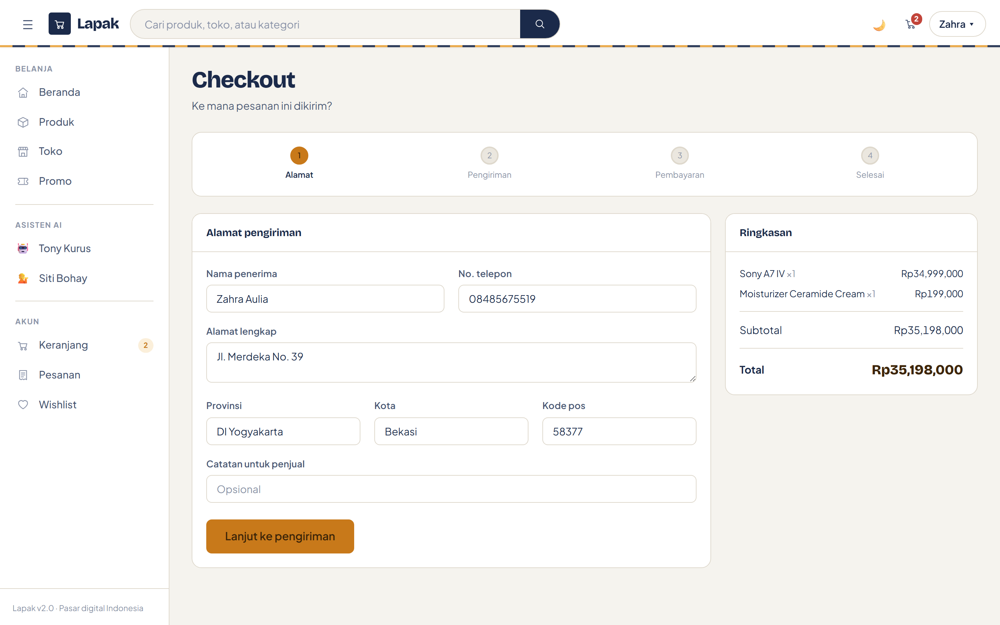

### Checkout — pengiriman

Tujuh kurir dengan tiga level layanan; ongkir disimulasikan bila RajaOngkir belum
dikonfigurasi.

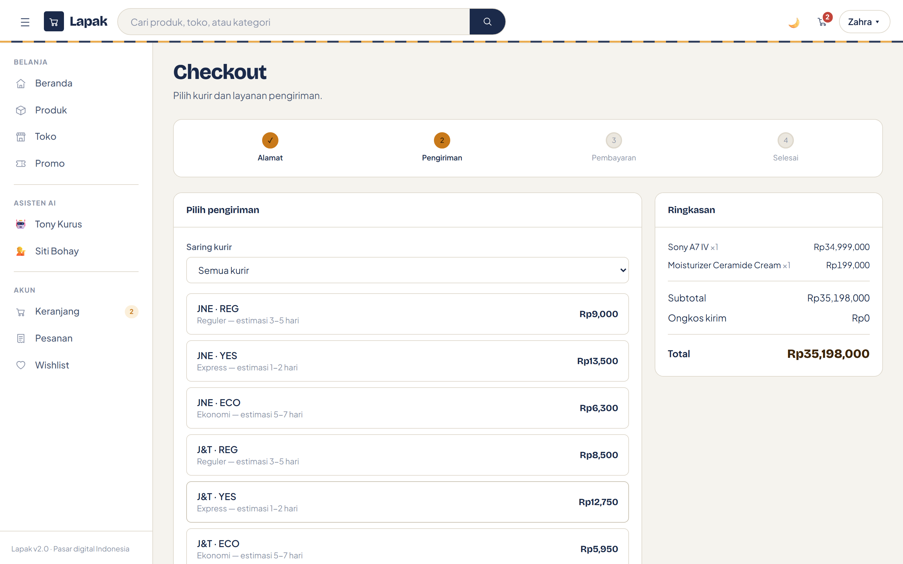

### Checkout — pembayaran

Midtrans, Xendit, dan Stripe muncul sebagai pilihan. Gateway yang kredensialnya
belum diisi tampil nonaktif, bukan disembunyikan, supaya jelas apa yang kurang.


### Pesanan saya

Pesanan yang belum lunas bisa melanjutkan pembayaran dari sini.


---

## Penjual

### Kelola toko

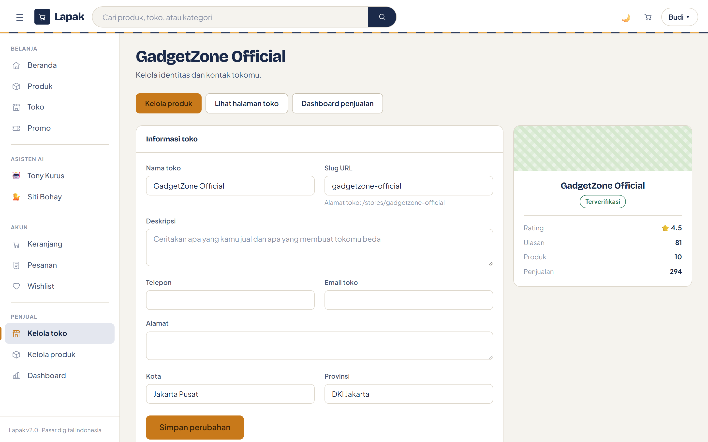

### Kelola produk


### Tambah produk

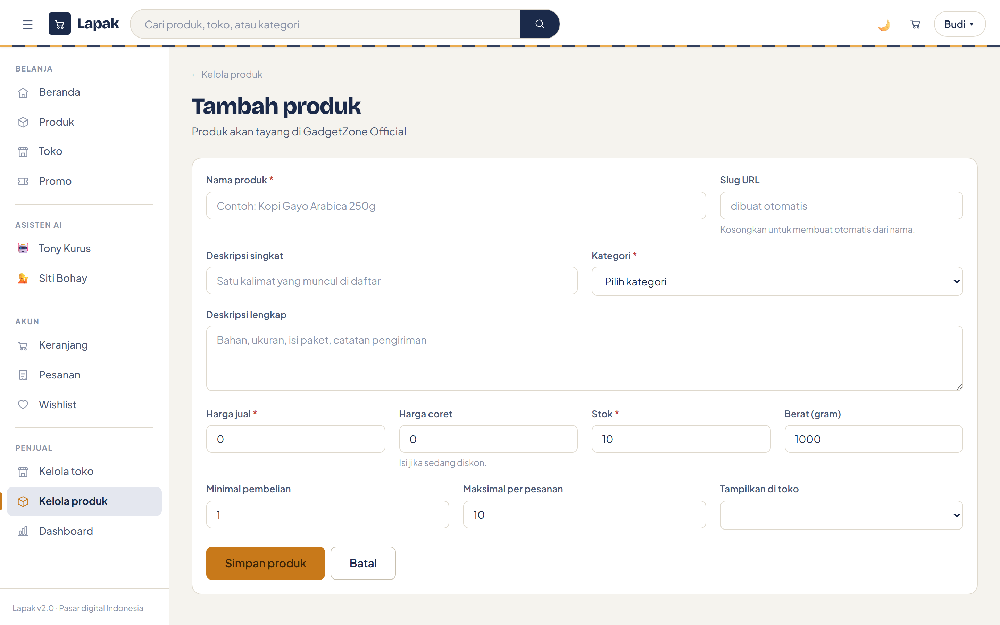

---

## Admin dan laporan

### Dashboard

Grafik memakai jumlah pesanan harian sebenarnya dalam rentang yang dipilih.


### Dashboard, tema gelap


### Panel admin

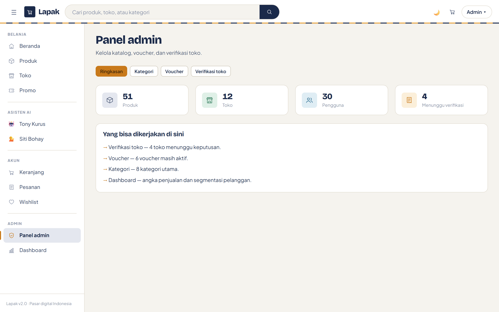

### Manajemen voucher

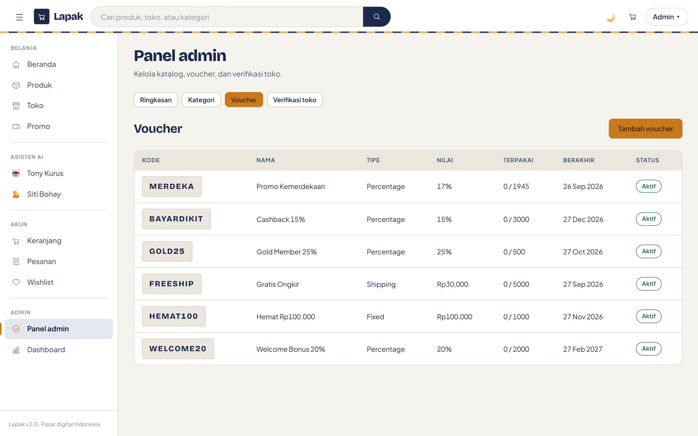

---

## Mobile

Sidebar berubah jadi laci, dan navigasi pindah ke bilah bawah.

| Beranda | Produk |
|---|---|
|  | 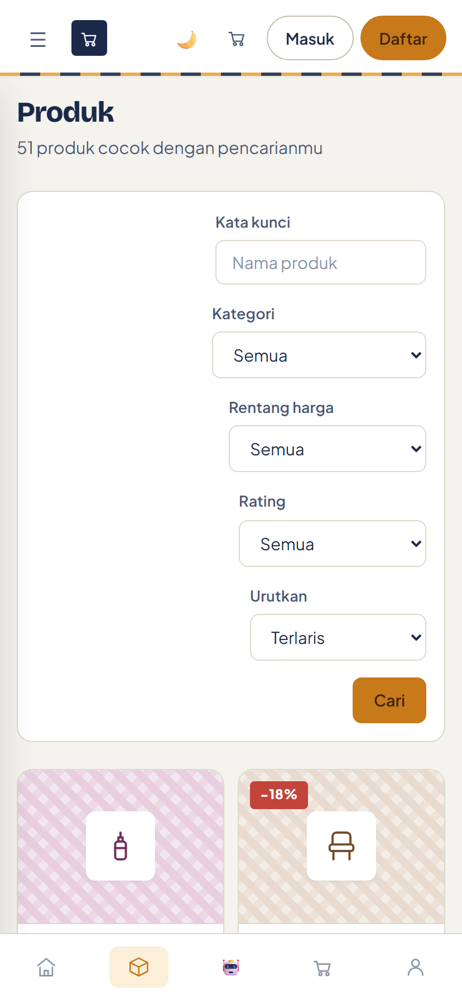 |

---

## Autentikasi

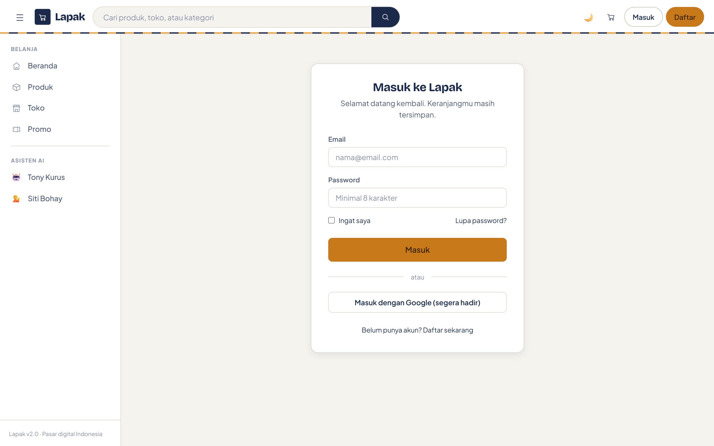

---

## Cara memperbarui

Tangkapan layar dibuat dengan Playwright terhadap aplikasi yang sedang berjalan.

```bash
# 1. jalankan aplikasi dengan data contoh yang bersih
rm -f lapak.db*
dotnet run

# 2. di terminal lain, jalankan skrip penangkap layar
npm install playwright
npx playwright install chromium
node scripts/shoot.js http://localhost:5247 docs/screenshots
```

Skrip masuk memakai akun demo (password `Lapak2025!`), mengisi keranjang, dan
melangkah sampai layar pembayaran supaya setiap halaman berisi data sungguhan.

Kalau menambah tangkapan layar baru, pakai penomoran yang sudah ada
(`NN-nama-halaman.png`) supaya urutannya tetap terbaca.
