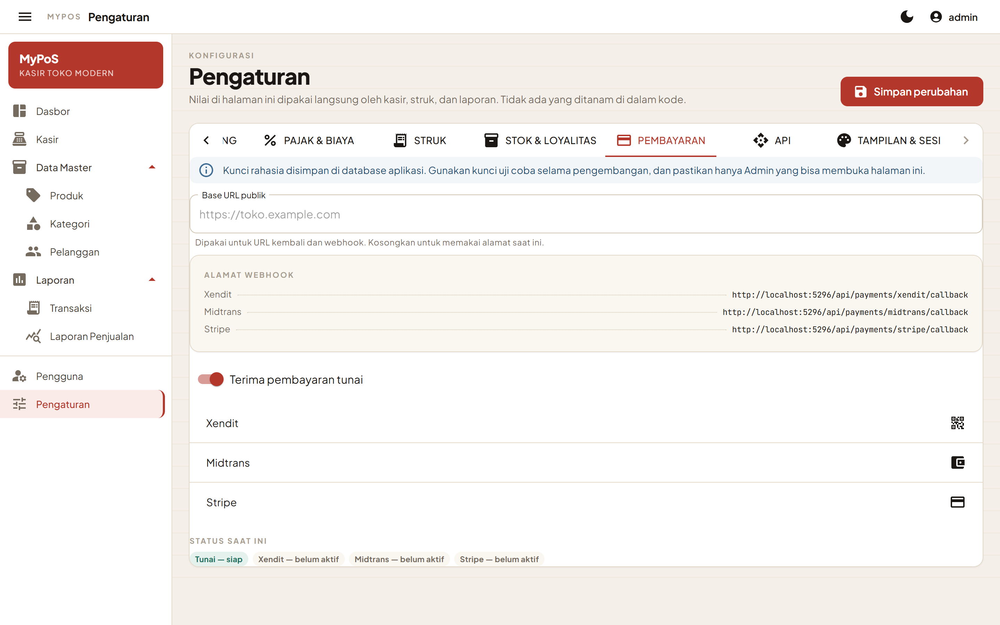

# Pembayaran digital

MyPoS mendukung empat metode: **Tunai**, **Xendit**, **Midtrans**, dan **Stripe**. Semuanya dipasang lewat antarmuka yang sama, `IPaymentGateway`, sehingga halaman kasir tidak perlu tahu penyedia mana yang sedang aktif.

Penyedia baru hanya muncul di halaman kasir bila dua syarat terpenuhi: sakelarnya diaktifkan **dan** kunci rahasianya sudah diisi.



## Memasang penyedia

Buka **Pengaturan → Pembayaran** sebagai Admin.

### Xendit

| Kolom | Dari mana |
|---|---|
| Secret Key | Dasbor Xendit → Settings → API Keys |
| Callback Verification Token | Dasbor Xendit → Settings → Webhooks |

Menggunakan Invoice API (`POST https://api.xendit.co/v2/invoices`) dengan otentikasi HTTP Basic. Pelanggan diarahkan ke halaman `invoice_url` yang dikembalikan Xendit.

### Midtrans

| Kolom | Dari mana |
|---|---|
| Server Key | Dasbor Midtrans → Settings → Access Keys |
| Client Key | Dasbor Midtrans → Settings → Access Keys |
| Mode produksi | Nonaktif untuk sandbox |

Menggunakan Snap (`POST /snap/v1/transactions`). Pengecekan status memakai Core API, yang hostnya berbeda dari host Snap — keduanya sudah ditangani terpisah di dalam kode.

Midtrans mensyaratkan `gross_amount` sama persis dengan jumlah `item_details`. Karena pajak, diskon, dan pembulatan tidak dapat dikirim sebagai baris tersendiri, selisihnya dikirim sebagai satu baris penyesuaian bernama "Pajak & biaya" atau "Diskon & pembulatan".

### Stripe

| Kolom | Dari mana |
|---|---|
| Secret Key | Dasbor Stripe → Developers → API keys |
| Mata uang | Huruf kecil, mis. `idr` atau `usd` |

Menggunakan Checkout Session (`POST /v1/checkout/sessions`, form-encoded).

Dua hal yang perlu diketahui:

- **Satuan terkecil.** IDR bukan mata uang tanpa pecahan di Stripe, sehingga nominal dikirim dalam sen — dikalikan 100. Daftar mata uang tanpa pecahan (JPY, KRW, VND, dan lainnya) sudah tertanam di `StripePaymentGateway`.
- **Satu baris gabungan.** Total Checkout Session selalu sama dengan jumlah line item, dan Stripe menolak baris bernilai negatif. Karena itu transaksi dikirim sebagai satu baris dengan nominal total, dan rincian barangnya diletakkan pada deskripsi. Rincian penuh tetap ada di struk MyPoS.

## Webhook

Alamat yang perlu didaftarkan di dasbor penyedia tertera langsung di halaman Pengaturan:

```
https://domain-anda.com/api/payments/xendit/callback
https://domain-anda.com/api/payments/midtrans/callback
https://domain-anda.com/api/payments/stripe/callback
```

Isi **Base URL publik** di halaman Pengaturan bila aplikasi berada di belakang proxy atau nama domain yang berbeda dari alamat internalnya.

### Cara notifikasi diperlakukan

Isi notifikasi **tidak dipercaya**. Endpoint hanya membaca satu hal darinya, yaitu nomor invoice mana yang berubah:

| Penyedia | Kolom yang dibaca |
|---|---|
| Xendit | `external_id` |
| Midtrans | `order_id` |
| Stripe | `data.object.client_reference_id` |

Setelah itu status sebenarnya ditanyakan langsung ke penyedia lewat `CheckStatusAsync`, dan hasil dari penyedia itulah yang disimpan. Dengan begitu, notifikasi palsu yang mengaku "sudah lunas" tidak dapat menandai transaksi apa pun sebagai lunas.

Khusus Xendit, header `x-callback-token` juga dicocokkan dengan token yang tersimpan bila token tersebut diisi.

## Alur transaksi non-tunai

1. Kasir menekan **Bayar**. Transaksi disimpan dengan status **Menunggu pembayaran** dan stok langsung dikurangi, supaya barang yang sama tidak terjual dua kali selagi pelanggan masih di halaman pembayaran.
2. Halaman pembayaran penyedia terbuka di tab baru.
3. Pelanggan menyelesaikan pembayaran dan kembali ke `/pembayaran/sukses` atau `/pembayaran/gagal`. Halaman ini sengaja tidak menentukan status apa pun — ia hanya memberi tahu pelanggan bahwa pembayarannya sedang dikonfirmasi.
4. Status berubah menjadi **Lunas** melalui salah satu dari dua jalur: webhook dari penyedia, atau tombol **Cek status** di halaman Transaksi.
5. Bila pembayaran gagal atau kedaluwarsa, stok dikembalikan secara otomatis.

## Menambah penyedia baru

1. Buat kelas yang mengimplementasikan `IPaymentGateway` di `Services/Payments/`.
2. Tambahkan properti kredensialnya ke `PosSettings` — kolomnya akan otomatis tersimpan di basis data tanpa perlu mengubah skema.
3. Daftarkan di `Program.cs`:

```csharp
builder.Services.AddSingleton<IPaymentGateway, PenyediaBaruGateway>();
```

4. Tambahkan panelnya di tab Pembayaran pada `Pages/Settings.razor`.

`PaymentGatewayResolver` dan halaman kasir akan mengenalinya dengan sendirinya.

## Menguji tanpa akun penyedia

Metode **Tunai** selalu tersedia dan tidak memanggil layanan luar, sehingga seluruh alur transaksi — struk, stok, poin loyalitas, laporan — dapat diuji tanpa kunci apa pun. Untuk menguji jalur non-tunai, gunakan kunci sandbox: Xendit `xnd_development_…`, Midtrans dengan mode produksi dinonaktifkan, dan Stripe `sk_test_…`.
