# Tangkapan layar

Seluruh gambar di bawah ini diambil otomatis dari aplikasi yang benar-benar berjalan, pada lebar 1440 px dengan kerapatan piksel 2×.

## Halaman masuk

Sisi kiri membuka dengan benda paling khas dari dunia kasir, yaitu struk itu sendiri — sekaligus memperlihatkan cara aplikasi menyusun angka sebelum pengguna menekan satu tombol pun.

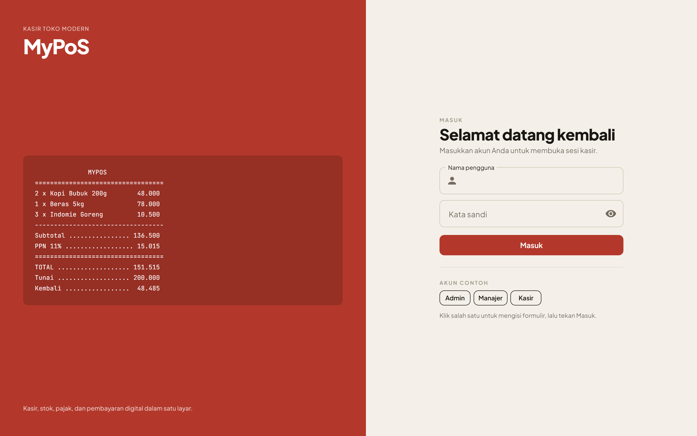

## Dasbor

Empat angka utama, tren penjualan 14 hari, produk terlaris, transaksi terakhir, dan daftar barang yang perlu diisi ulang.

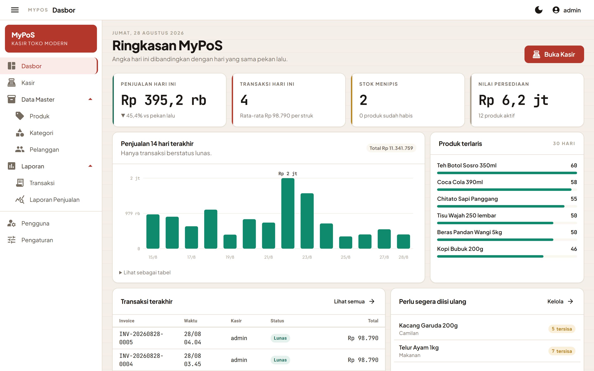

Grafik trennya memakai satu deret dan satu warna. Hanya batang tertinggi yang diberi label langsung — memberi angka pada setiap batang justru menutupi polanya — sedangkan sisanya muncul saat kursor menyentuh batang. Di bawahnya tersedia tampilan tabel untuk pembaca layar dan untuk angka yang persis.

## Kasir

Katalog di kiri, struk berjalan di kanan.

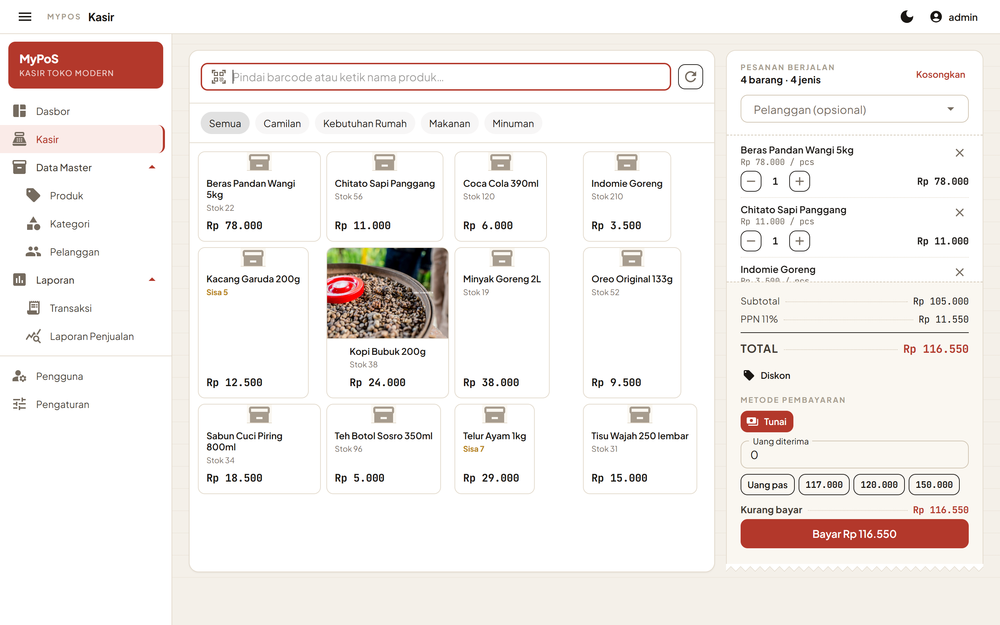

Panel kanan sengaja dibuat menyerupai struk: tepi bawahnya bergerigi seperti kertas yang baru dicabut dari printer, dan tiap barisnya memakai titik penuntun dari label menuju nominal. Seluruh angka memakai huruf monospace tabular sehingga kolom rupiah selalu lurus.

## Struk

Struk yang sama dipakai untuk pratinjau layar, pencetakan, dan penyalinan teks ke printer termal.

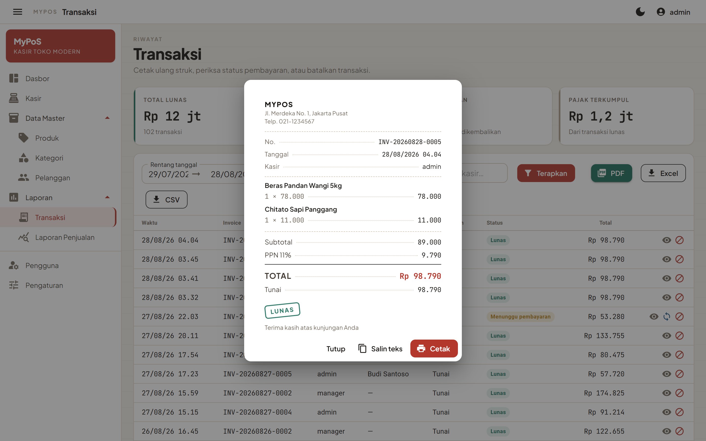

## Transaksi

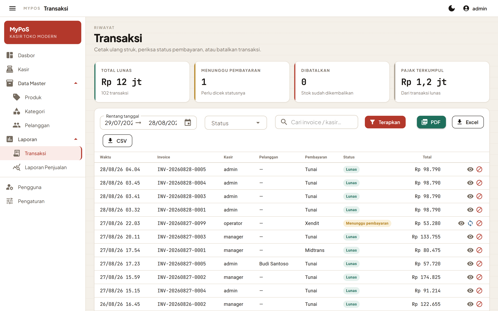

## Laporan penjualan

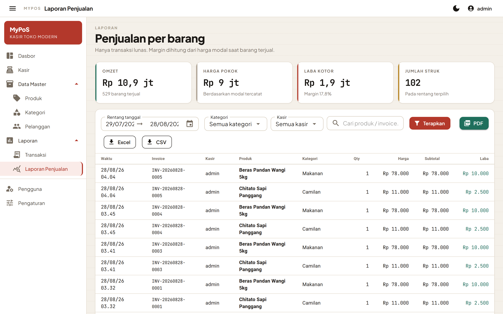

## Produk

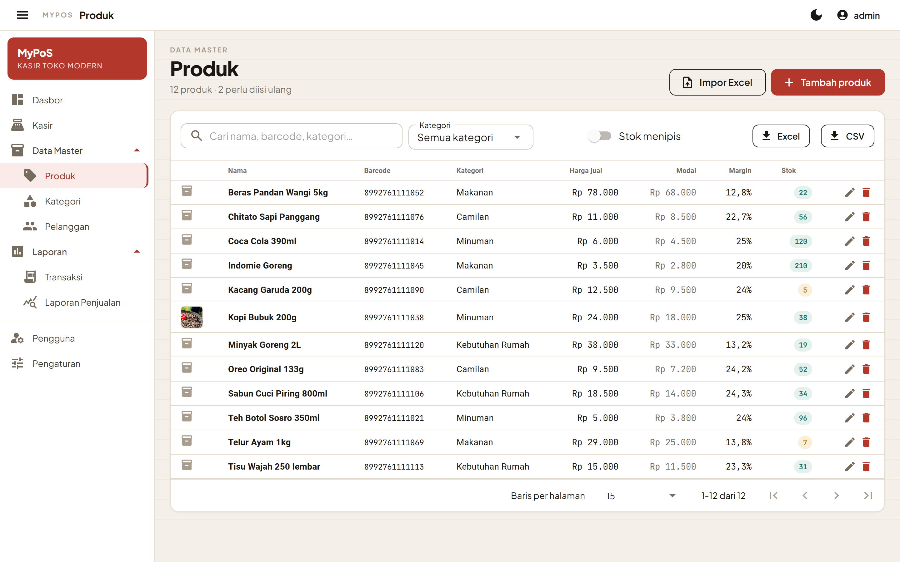

## Pengaturan

Panel Simulasi di sebelah kanan memakai `TaxCalculator` yang sama dengan halaman kasir, jadi akibat setiap perubahan dapat langsung diperiksa sebelum disimpan.

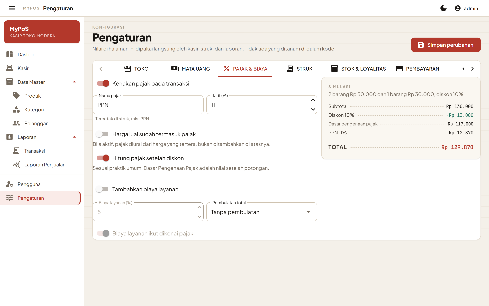


## REST API

Kunci dibuat dan dicabut dari tab API pada halaman Pengaturan. Nilai kunci penuh hanya
diperlihatkan satu kali saat dibuat.

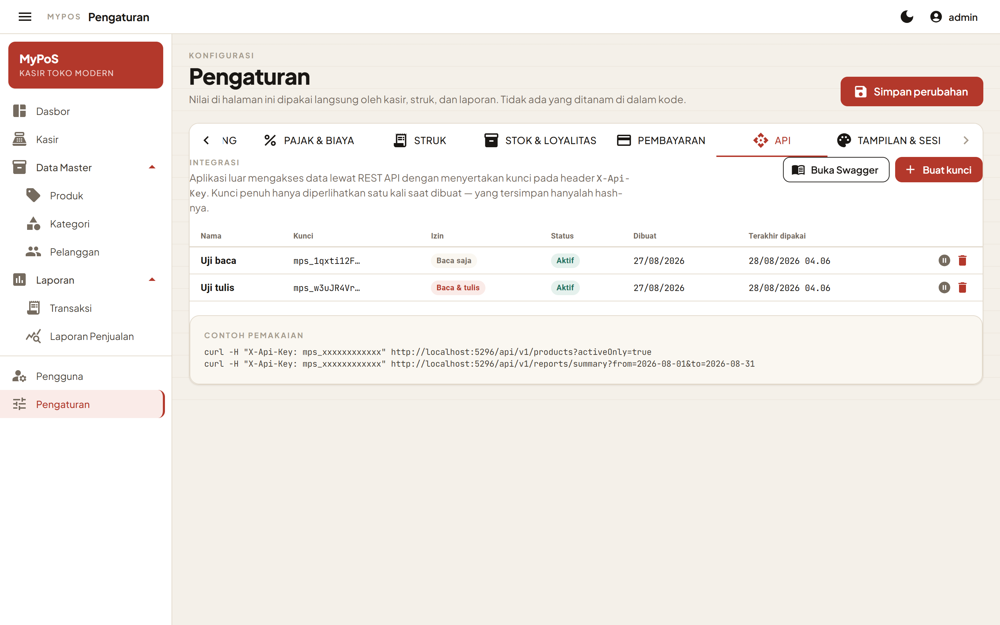

Dokumentasi interaktif tersedia di `/swagger`, lengkap dengan tombol Authorize yang
menyertakan header `X-Api-Key` pada setiap percobaan permintaan.

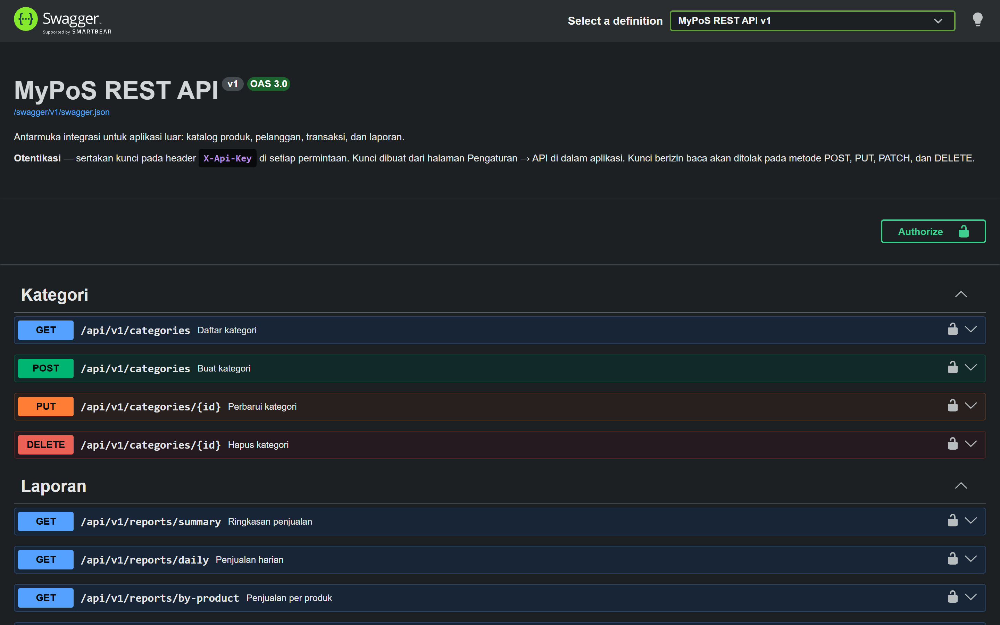

## Impor data master

Langkah pertama menawarkan template siap pakai beserta dua pilihan yang menentukan
bagaimana data lama diperlakukan.

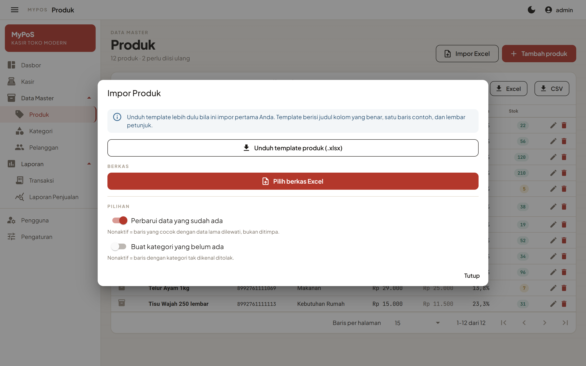

Setelah berkas diunggah, isinya diperiksa dan ditampilkan baris per baris — termasuk baris
yang bermasalah beserta alasannya — sebelum satu baris pun tersimpan.

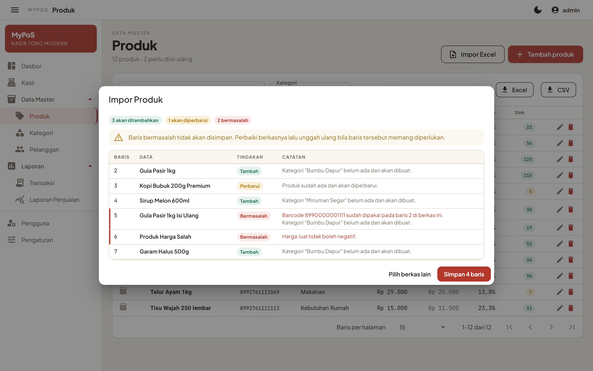

## Laporan PDF

Ekspor PDF memakai kolom, ringkasan, dan penyaring yang sama dengan yang sedang tampil
di layar, dengan kepala tabel yang diulang di setiap halaman.

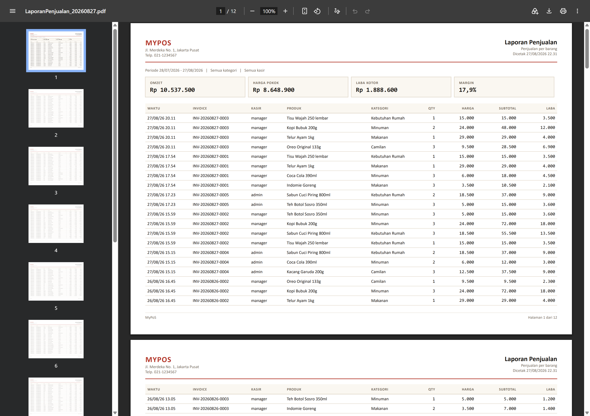

## Mode gelap

Bukan pembalikan warna otomatis: setiap token punya nilai tersendiri untuk mode gelap, termasuk warna grafiknya.

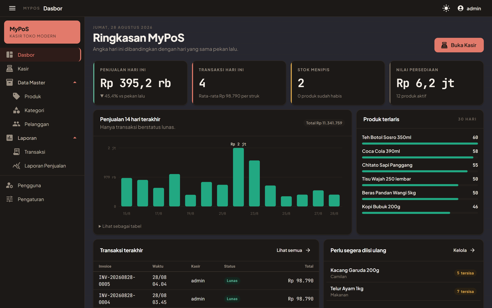

---

## Membuat ulang tangkapan layar

Skripnya ada di `docs/tools/screenshot.mjs`. Tidak ada dependensi yang perlu dipasang — skrip ini mengendalikan Chrome atau Edge lewat Chrome DevTools Protocol memakai `WebSocket` dan `fetch` bawaan Node.

**Prasyarat:** Node 22 atau lebih baru, serta Chrome atau Edge yang terpasang.

1. Jalankan aplikasi:

   ```bash
   dotnet run --launch-profile http
   ```

2. Jalankan skripnya dari terminal lain:

   ```bash
   node docs/tools/screenshot.mjs http://localhost:5296 docs/screenshots
   ```

Skrip akan masuk sebagai `admin`, menyusuri setiap halaman, mengisi keranjang di halaman kasir, membuka struk, berpindah tab di halaman Pengaturan, membuka Swagger, lalu menyalakan mode gelap. Setiap langkah yang gagal dilaporkan tanpa menghentikan langkah lainnya, dan kode keluarnya bukan nol bila ada yang gagal.

Dua tangkapan layar dibuat terpisah karena memerlukan berkas dari luar aplikasi:

- `13-laporan-pdf.png` — unduh PDF-nya dari halaman Laporan Penjualan, lalu buka berkasnya
  di peramban dan potret halaman pertamanya.
- `15-impor-pratinjau.png` — unduh template dari halaman Produk, isi beberapa baris termasuk
  satu yang sengaja salah, lalu unggah dan potret pratinjaunya sebelum disimpan.
  (`14-impor-template.png` sendiri ikut dibuat otomatis oleh skrip karena tidak perlu berkas.)

Untuk menghasilkan data contoh yang isinya masuk akal — riwayat penjualan beberapa pekan, produk yang stoknya menipis, satu transaksi yang menunggu pembayaran — lakukan beberapa transaksi lewat halaman kasir sebelum menjalankan skrip. Basis data yang baru dibuat hanya berisi produk, kategori, pelanggan, dan pengguna contoh tanpa riwayat transaksi apa pun.
