# SMSNet Documentation

Dokumentasi lengkap tersedia dalam dua bahasa.
Full documentation is available in two languages.

| 🇮🇩 Bahasa Indonesia | 🇬🇧 English |
| --- | --- |
| [Instalasi & Konfigurasi](id/instalasi.md) | [Installation & Configuration](en/installation.md) |
| [Arsitektur](id/arsitektur.md) | [Architecture](en/architecture.md) |
| [Panduan Fitur](id/fitur.md) | [Feature Guide](en/features.md) |
| [Hak Akses (RBAC)](id/rbac.md) | [Access Control (RBAC)](en/rbac.md) |
| [Penjadwalan Otomatis](id/penjadwalan.md) | [Automatic Timetabling](en/scheduling.md) |
| [Editor, Komentar & Unggahan](id/kolaborasi.md) | [Rich Text, Comments & Uploads](en/collaboration.md) |
| [Absensi QR & Kartu](id/absensi-qr.md) | [QR Attendance & Cards](en/qr-attendance.md) |
| [Metode Pembayaran](id/pembayaran.md) | [Payment Gateways](en/payments.md) |
| [Asisten "Pak Dedi"](id/asisten.md) | [The "Pak Dedi" Assistant](en/assistant.md) |
| [REST API](id/api.md) | [REST API](en/api.md) |
| [Deployment](id/deployment.md) | [Deployment](en/deployment.md) |

Dokumen perencanaan ada di akar repositori — planning documents live in the repository root:

- [`PLAN.md`](../PLAN.md) — peta jalan pengembangan / development roadmap
- [`Progress.md`](../Progress.md) — catatan kemajuan / progress log
- [`requirements.md`](../requirements.md) — spesifikasi awal / original specification

---

## Tangkapan Layar / Screenshots

Seluruh gambar diambil dari aplikasi yang berjalan, bukan mockup.
All images are captured from the running application, not mockups.

| | |
| --- | --- |
| 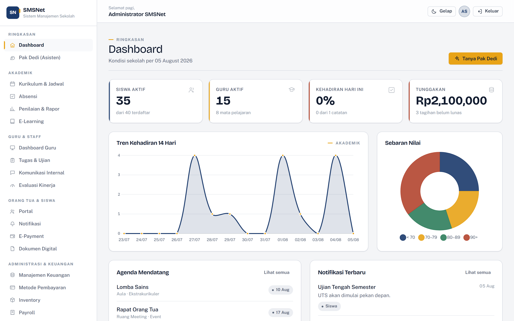 **Dashboard** | 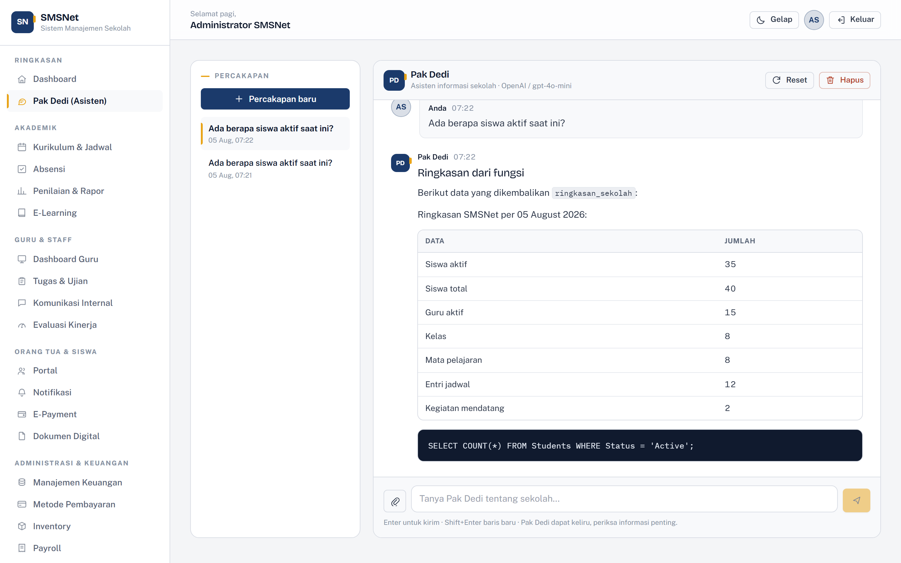 **Pak Dedi** |
| 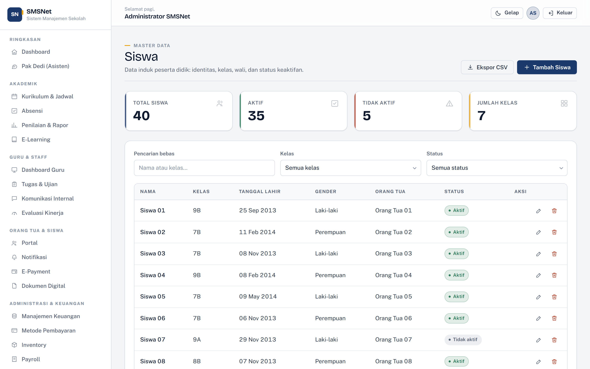 **Master Data** | 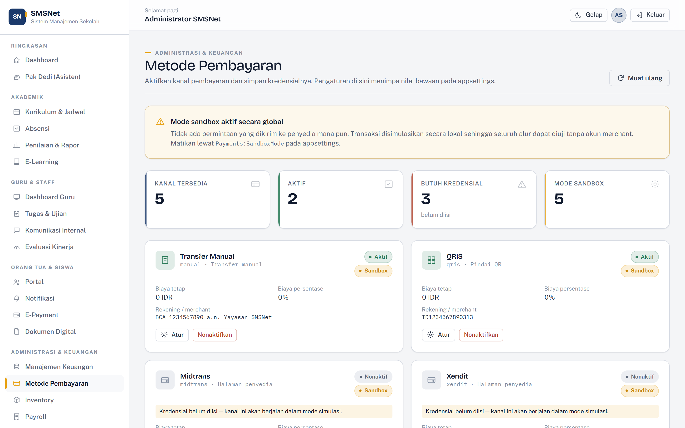 **Metode Pembayaran** |
| 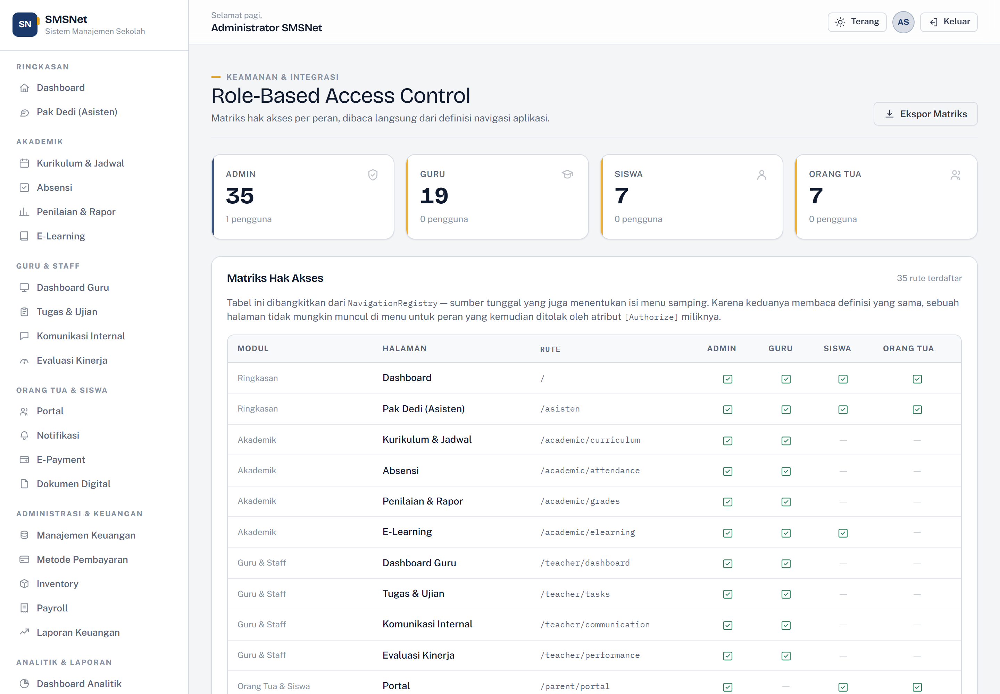 **Matriks RBAC** | 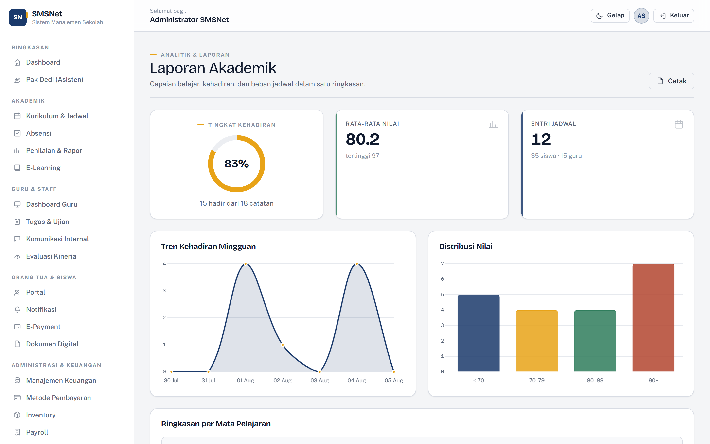 **Laporan Akademik** |
| 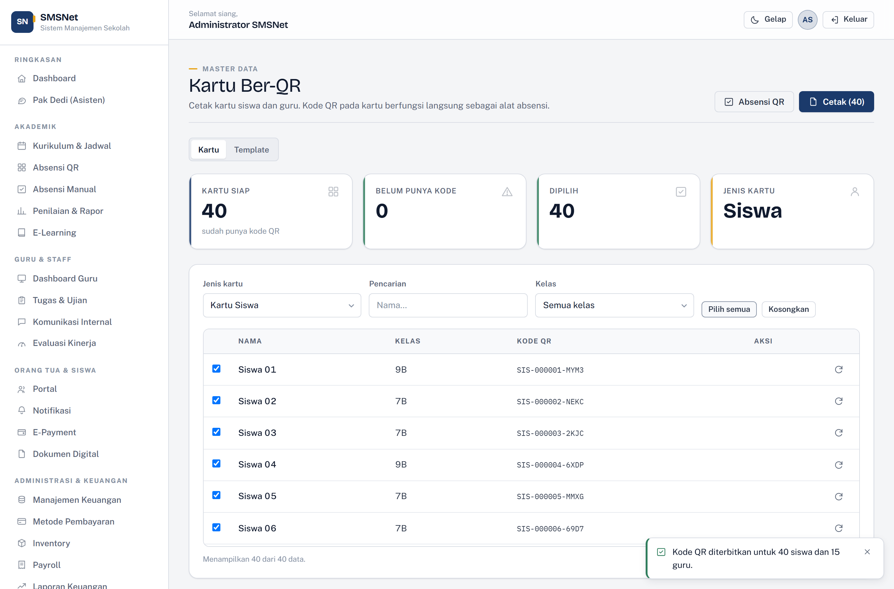 **Kartu Ber-QR** | 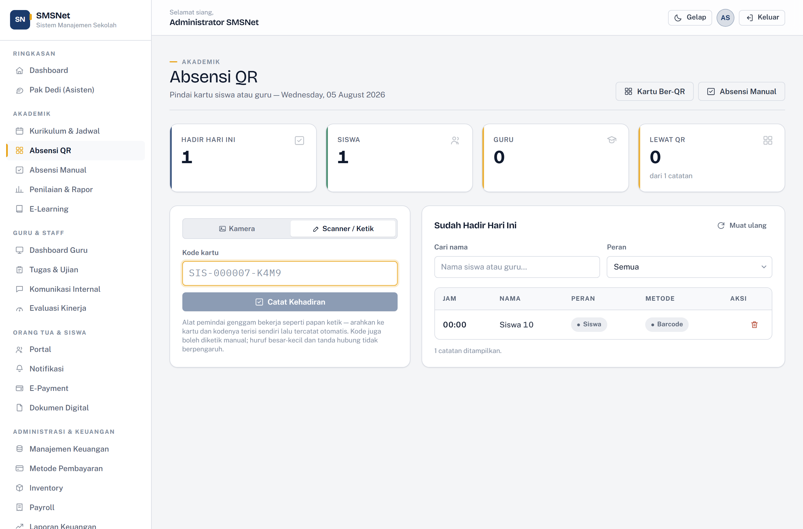 **Absensi QR** |
| 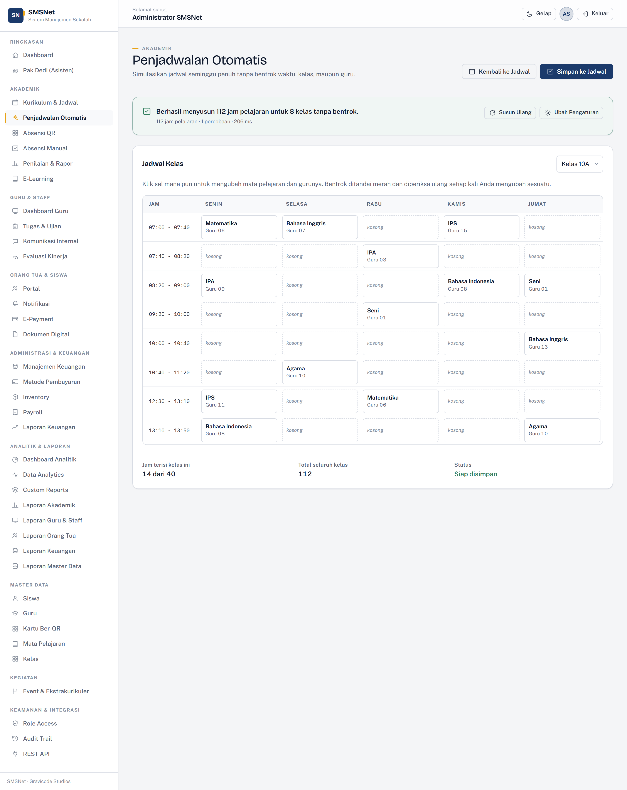 **Penjadwalan Otomatis** | 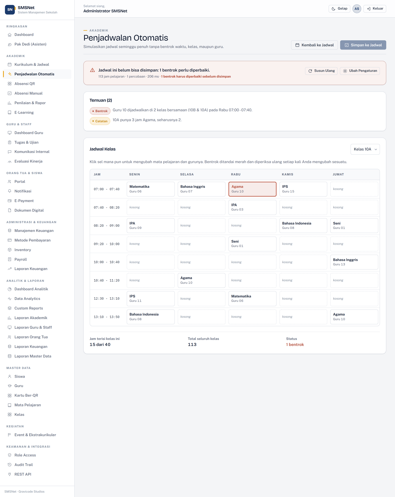 **Deteksi Bentrok** |
| 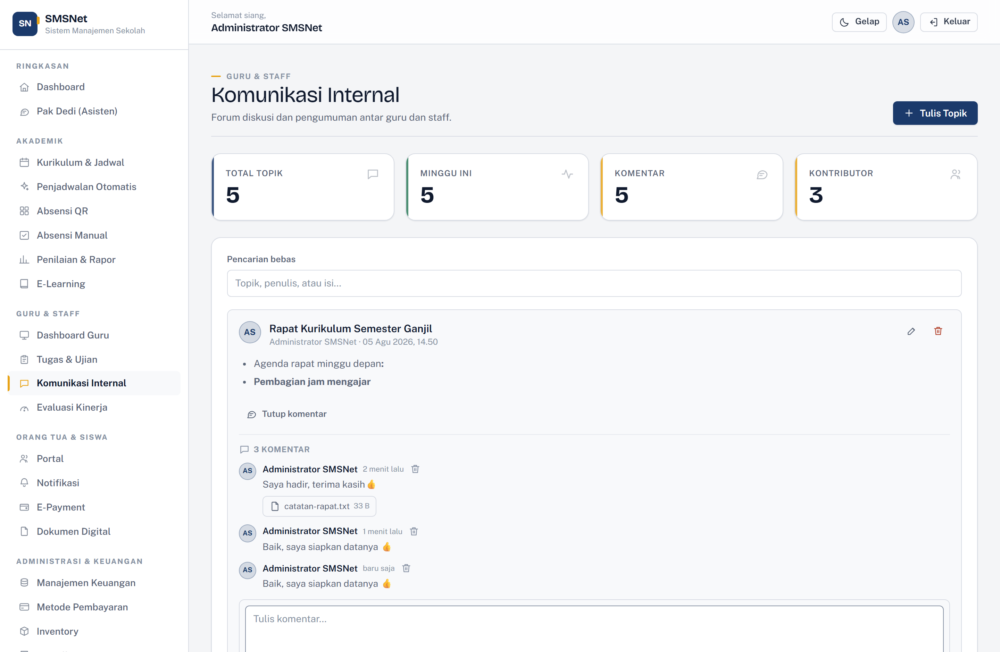 **Forum & Komentar** | 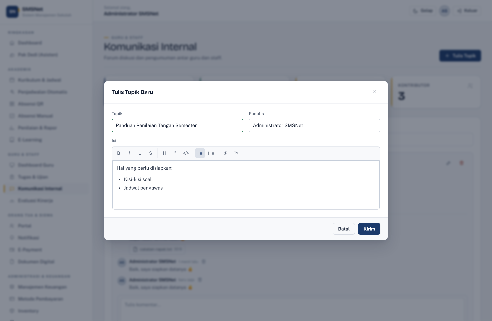 **Editor Teks** |
| 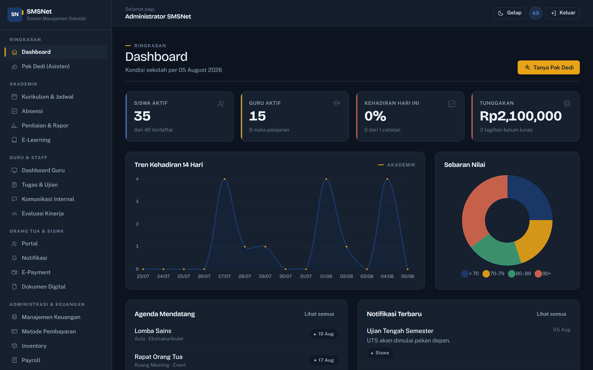 **Tema Gelap** | 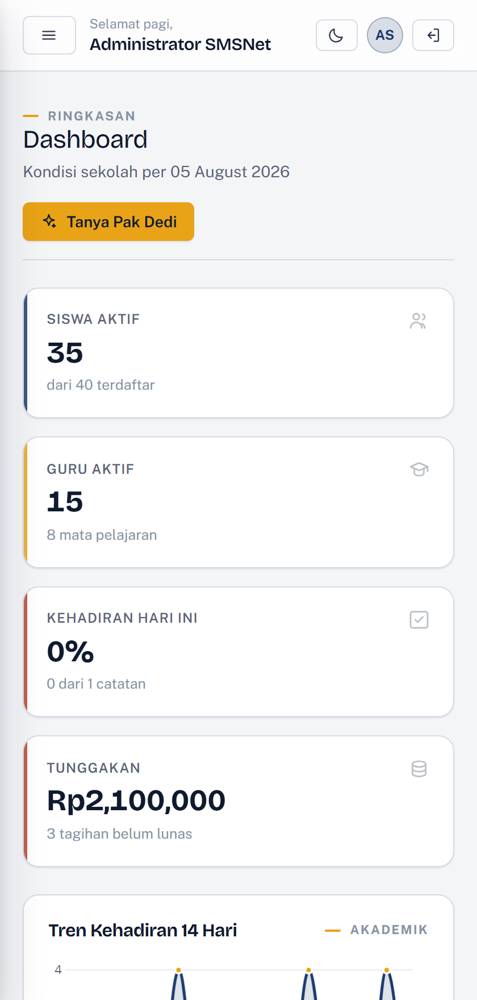 **Tampilan Ponsel** |
