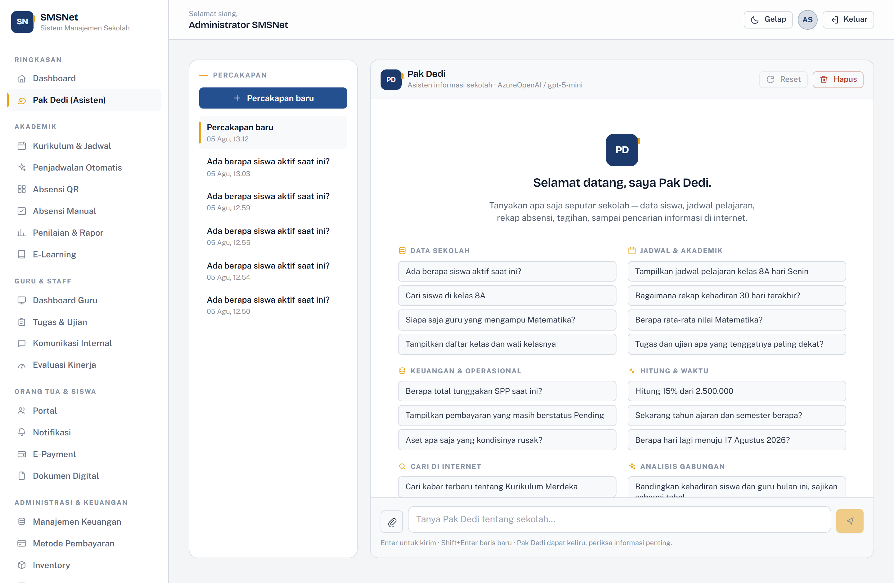

# The "Pak Dedi" Assistant

[← Back to documentation index](../README.md) · [Versi Bahasa Indonesia](../id/asisten.md)

---


Pak Dedi is a school information assistant that answers by **reading the school's actual
records**, not by inventing them. It is built on **Semantic Kernel 1.78** and runs
against five model providers.

---

## What it does

| Capability | Detail |
| --- | --- |
| Multi-session | Create, select, reset, and delete conversations. Titles are generated from the opening question. |
| Example prompts | The welcome screen offers 19 examples in 6 groups — one click sends them. |
| Attachments | Images (PNG, JPEG, GIF) are sent as visual content; documents are uploaded and their links included in the message. |
| Function calling | 24 functions across 4 plugins, invoked automatically by the model. |
| Markdown | Tables, code blocks with a copy button, media (image/video/audio), lists, quotes. |
| Role-aware | Data functions check the caller's role rather than trusting the prompt. |
| History | Conversations persist in the database and survive a page reload. |

---

## Choosing a provider

Five providers are supported. Select via `Assistant:Provider`.

| Provider | Value | API key | Notes |
| --- | --- | --- | --- |
| OpenAI | `OpenAI` | Required | Default. Supports compatible endpoints via `Endpoint`, including DeepSeek. |
| Azure OpenAI | `AzureOpenAI` | Required | Addressed by deployment name — see below. |
| Anthropic | `Anthropic` | Required | Hand-written connector — see below. |
| Google Gemini | `Google` | Required | The Semantic Kernel connector is still alpha. |
| Ollama | `Ollama` | Not needed | Runs models locally. The option for air-gapped environments. |

### Example configuration

```bash
# OpenAI
export Assistant__Provider="OpenAI"
export Assistant__OpenAI__ApiKey="sk-..."
export Assistant__OpenAI__Model="gpt-4o-mini"

# OpenAI-compatible (DeepSeek, for example) — only the endpoint changes
export Assistant__Provider="OpenAI"
export Assistant__OpenAI__ApiKey="sk-..."
export Assistant__OpenAI__Endpoint="https://api.deepseek.com"
export Assistant__OpenAI__Model="deepseek-v4-flash"

# Azure OpenAI
export Assistant__Provider="AzureOpenAI"
export Assistant__AzureOpenAI__ApiKey="..."
export Assistant__AzureOpenAI__Endpoint="https://yourresource.openai.azure.com/"
export Assistant__AzureOpenAI__Deployment="gpt-5-mini"   # deployment name, not model name
export Assistant__AzureOpenAI__ModelId="gpt-5-mini"

# Anthropic
export Assistant__Provider="Anthropic"
export Assistant__Anthropic__ApiKey="sk-ant-..."
export Assistant__Anthropic__Model="claude-opus-5"
export Assistant__Anthropic__Effort="medium"

# Google Gemini
export Assistant__Provider="Google"
export Assistant__Google__ApiKey="..."
export Assistant__Google__Model="gemini-2.0-flash"

# Ollama — no key
export Assistant__Provider="Ollama"
export Assistant__Ollama__Endpoint="http://localhost:11434"
export Assistant__Ollama__Model="llama3.1"
```

### Azure OpenAI is addressed differently

Azure is **not** OpenAI with a different `Endpoint`. Its URLs carry a deployment name and
require an `api-version` query string, so the plain OpenAI connector cannot reach it.
That is why Azure gets its own settings section.

The deployment name is whatever you named it in Azure AI Foundry, and is **not always**
the model name. `ModelId` may be left empty; when it is, the deployment name is used as
the model label in the interface.

### Reasoning models reject the sampling parameters

The **gpt-5** and **o1/o3/o4** families — via OpenAI or Azure alike — reject `max_tokens`
(it must be `max_completion_tokens`) and accept only the default `temperature` and
`top_p`. Semantic Kernel emits the classic parameter names, so sending any of them is an
**HTTP 400**.

The app recognises those models by name and **omits all three**, taking the service
defaults instead. So `Assistant:Temperature`, `TopP`, and `MaxTokens` are ignored on a
reasoning model — that is deliberate, not a setting failing to bind.

### Why the Anthropic connector is hand-written

Microsoft does **not** ship `Microsoft.SemanticKernel.Connectors.Anthropic`. The
available community package (`Lost.SemanticKernel.Connectors.Anthropic`) sits at
1.25-alpha while the Semantic Kernel this application uses is 1.78 — 53 minor versions
apart.

So `Services/Assistant/AnthropicChatCompletionService.cs` implements
`IChatCompletionService` directly on top of the **official Anthropic SDK**, including
its own tool-call loop. That is safer than pinning a version-mismatched dependency.

> **Temperature is not sent to Anthropic.** Current Claude models reject `temperature`
> and `top_p` with a 400. Reasoning depth is controlled through
> `Assistant:Anthropic:Effort` (`low`, `medium`, `high`, `xhigh`, `max`) instead. The
> `Assistant:Temperature` value still applies to OpenAI, Google, and Ollama.

> **WebP is not accepted as an image attachment.** The Anthropic SDK's media-type enum
> covers PNG, JPEG, and GIF only, so WebP is rejected at upload time — rather than after
> the request has already been built and sent.

---

## Settings

All under the `Assistant` section of `appsettings.json`.

| Key | Default | Meaning |
| --- | --- | --- |
| `Name` | `Pak Dedi` | Name shown in the interface |
| `Tagline` | `Asisten informasi sekolah` | Subtitle under the name |
| `Provider` | `OpenAI` | Active provider |
| `SystemPromptLines` | (built-in persona) | Persona, one line per array element |
| `Temperature` | `0.4` | Applies to OpenAI, Google, Ollama — ignored on reasoning models |
| `TopP` | `0.95` | As above |
| `MaxTokens` | `2048` | Answer length ceiling — ignored on reasoning models |
| `AzureOpenAI.Deployment` | (empty) | Azure deployment name; required when `Provider = AzureOpenAI` |
| `HistoryWindow` | `20` | How many prior turns are replayed |
| `EnableFunctionCalling` | `true` | Let the model call functions itself |
| `MaxToolIterations` | `6` | Cap on tool-call round trips per turn |
| `Uploads.MaxFileSizeBytes` | `10485760` | 10 MB |
| `Uploads.MaxFilesPerMessage` | `5` | Attachment limit per message |
| `Tavily.ApiKey` | (empty) | Leave empty to disable internet search |

### Changing the persona

The persona is written as an array of lines because JSON has no multi-line string, and
a single escaped blob would be unusable to edit by hand:

```json
"SystemPromptLines": [
  "Kamu adalah \"Pak Dedi\", asisten informasi resmi sekolah pada aplikasi SMSNet.",
  "",
  "Kepribadian:",
  "- Ramah, sabar, dan sopan — seperti staf tata usaha senior."
]
```

Emptying the array restores the built-in persona rather than sending an empty prompt.

---

## Example prompts



An empty conversation shows **19 example questions** across six groups. One click sends
them — no retyping.

| Group | Examples |
| --- | --- |
| **Data sekolah** (school data) | "How many students are active?" · "Which teachers take Mathematics?" |
| **Jadwal & akademik** (schedule & academics) | "Show class 8A's Monday timetable" · "What is the Mathematics average?" |
| **Keuangan & operasional** (finance & operations) | "What are the total unpaid SPP fees?" · "Which assets are damaged?" |
| **Hitung & waktu** (maths & time) | "Calculate 15% of 2,500,000" · "How many days until 17 August 2026?" |
| **Cari di internet** (internet search) | "Find recent news about Kurikulum Merdeka" |
| **Analisis gabungan** (combined analysis) | "Which students are below the KKM *and* behind on payments?" |

The last group deliberately forces **more than one function** into a single turn, because
that capability is the hardest for a new user to guess from an empty input box.

The prompts live in `Components/Pages/Assistant/Chat.razor` (the `PromptGroup` list) and
can be tailored per school.

---

## Available functions (24)

### Waktu (time) plugin

Without this the model answers "today" from its training cutoff, which is always wrong.

| Function | Purpose |
| --- | --- |
| `tanggal_hari_ini` | Current date and time in WIB |
| `hitung_selisih_hari` | Days between two dates |
| `tambah_hari` | Add or subtract days from a date |
| `info_tahun_ajaran` | Current academic year and semester (Indonesian calendar) |

### Matematika (maths) plugin

| Function | Purpose |
| --- | --- |
| `hitung` | Expression evaluation: `+ - * / % ^`, parentheses, `sqrt`, `abs`, `round`, `floor`, `ceil`, `min`, `max`, `pow`, `log`, `ln`, `exp`, `sin`, `cos`, `tan`, constants `pi` and `e` |
| `persentase` | Percentage of a part against a total |
| `statistik` | Count, sum, mean, median, min, max |

The evaluator is a hand-written recursive-descent parser over a closed grammar rather
than something like `DataTable.Compute`, so no expression string can reach a
general-purpose interpreter.

### Web plugin

| Function | Purpose |
| --- | --- |
| `cari_internet` | Search via Tavily |
| `baca_halaman` | Open a URL and return its text |
| `baca_file_dari_url` | Download a text file (txt, md, csv, json, xml) |

> **SSRF screening.** The last two fetch URLs the model chose, so loopback, private
> (10.x, 172.16–31.x, 192.168.x), link-local, CGNAT, and cloud-metadata (169.254.x)
> addresses are **rejected before the request is made**. Without that screen a
> prompt-injected "read http://169.254.169.254/…" would turn the assistant into a proxy
> for the host's own network.

### SekolahData (school data) plugin

| Function | Role restriction |
| --- | --- |
| `ringkasan_sekolah` | All |
| `cari_siswa` | admin, guru |
| `cari_guru` | All (contact details staff-only) |
| `daftar_kelas` | All |
| `daftar_mata_pelajaran` | All |
| `jadwal_pelajaran` | All |
| `rekap_absensi` | admin, guru |
| `nilai_siswa` | Non-staff must name a student |
| `daftar_tugas_ujian` | All |
| `materi_elearning` | All |
| `rekap_pembayaran` | admin, orangtua |
| `inventaris_sekolah` | admin, guru |
| `daftar_kegiatan` | All |
| `notifikasi_terbaru` | All |

Each function opens **its own DI scope** for a fresh `DbContext`, because several tool
calls can run concurrently and one context cannot serve overlapping queries.

---

## Security

| Concern | Handling |
| --- | --- |
| **Roles** | Checked inside the function body, not in the prompt |
| **SSRF** | Internal addresses rejected before the request |
| **Untrusted HTML** | Model output is sanitised: no `script`, `iframe`, event attributes, or inline `style` |
| **Outbound links** | Automatically `target="_blank"` with `rel="noopener noreferrer nofollow"` |
| **Uploads** | Allowlisted content types; stored filenames are generated, never the client's |
| **Session isolation** | Every query is scoped by `UserId`, so conversations cannot leak between users |
| **Secrets** | API keys never enter a prompt or an answer |

The render pipeline is always **render → sanitise → enrich**, because model output is
untrusted input: it may quote a web page it just fetched, and that page may carry a
payload.

---

## How one turn works

```
User sends a question
  → AssistantService assembles history + user context (name, role, date)
  → AssistantKernelFactory builds a Kernel for that role
      (built per turn, because the plugins are bound to the caller's roles —
       one shared kernel would leak admin data access into a student's session)
  → The model receives 24 function definitions
  → The model decides to call, say, ringkasan_sekolah
  → Semantic Kernel invokes it → database → result
  → The result returns to the model
  → The model composes an answer in Markdown
  → Markdig → HtmlSanitizer → media enrichment
  → Persisted as a ChatMessage → rendered
```

The function names used are shown under the answer as "Alat yang dipakai" (tools used),
so the trail can be followed.

---

## Troubleshooting

| Symptom | Cause | Fix |
| --- | --- | --- |
| "Asisten belum dikonfigurasi" | No API key | Set the environment variable for the chosen provider |
| "Pencarian internet belum aktif" | `Tavily:ApiKey` is empty | Add a Tavily key, or ignore if search is not wanted |
| 400 from Anthropic | A `temperature` parameter was sent | Should not happen — report it if it does |
| `'max_tokens' is not supported with this model` | A reasoning model not recognised by name | Report it — the name check in `AssistantKernelFactory` needs that family added |
| Azure returns 404 `DeploymentNotFound` | `Deployment` holds a model name rather than the deployment name | Copy the exact deployment name from Azure AI Foundry |
| `Temperature` appears to have no effect | The active model is a reasoning model | Expected — those models only accept the default |
| WebP attachment rejected | Not supported by the Anthropic SDK | Convert to PNG or JPEG |
| Answers cite the wrong date | The model did not call `tanggal_hari_ini` | Confirm `EnableFunctionCalling` is `true` |
| A function refuses the request | The user's role is not permitted | Expected — see the restriction table above |
