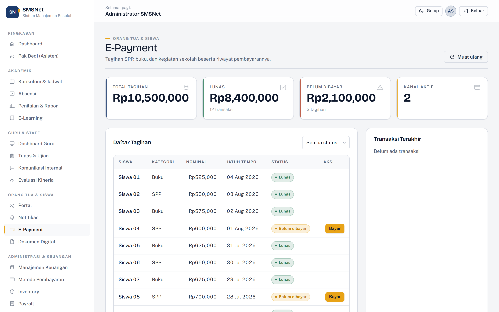

# Payment Gateways

[← Back to documentation index](../README.md) · [Versi Bahasa Indonesia](../id/pembayaran.md)

---


SMSNet supports five payment channels, configurable **from appsettings and from the
interface**, with no redeploy.

---

## Available channels

| Key | Name | Kind | Credentials |
| --- | --- | --- | --- |
| `manual` | Manual transfer | Bank transfer confirmed by staff | None — an account number is enough |
| `qris` | QRIS | Static QR code scan | None — a merchant string is enough |
| `midtrans` | Midtrans | Provider-hosted Snap page | Server key |
| `xendit` | Xendit | Provider-hosted invoice page | Secret key |
| `stripe` | Stripe | Checkout Session | Secret key |

`manual` and `qris` are enabled by default because both work from day one without any
merchant account.

---

## Sandbox mode

By default the application runs in **sandbox mode**:

```json
"Payments": { "SandboxMode": true }
```

In this mode **no request reaches any provider**. Charges are created locally with real
reference numbers, so the entire flow — issuing a bill, choosing a channel, showing
payment instructions, confirming, reconciling against the ledger — can be exercised
without a merchant account.

This is the state a school installs in.

To enable real calls, turn off the global sandbox and fill in the relevant channel's
credentials on the **Metode Pembayaran** page.

> **Worth stating plainly.** The HTTP integration points for Midtrans, Xendit, and
> Stripe are written in full and marked `LIVE CALL` in
> `Services/Payments/Gateways.cs`, but they have **never been exercised against a real
> account** because no credentials were available in the development environment. The
> request shapes follow each provider's documentation; verification against the
> provider's own sandbox account is still required before processing real money.

---

## Configuring via appsettings

Values here are the **defaults a fresh install boots with**. Settings saved through the
interface override them.

```json
"Payments": {
  "Currency": "IDR",
  "ReferencePrefix": "SMSNET",
  "ExpiryHours": 24,
  "SandboxMode": true,
  "Gateways": [
    {
      "Key": "manual",
      "DisplayName": "Transfer Manual",
      "Enabled": true,
      "SortOrder": 10,
      "AccountDetail": "BCA 1234567890 a.n. Yayasan SMSNet",
      "Instructions": "Transfer ke rekening sekolah, lalu unggah bukti pembayaran."
    },
    {
      "Key": "midtrans",
      "DisplayName": "Midtrans",
      "Enabled": false,
      "SandboxMode": true,
      "SecretKey": "",
      "FeePercent": 2.0
    }
  ]
}
```

For production, supply credentials via environment variables:

```bash
export Payments__Gateways__2__SecretKey="SB-Mid-server-..."
```

---

## Configuring via the interface

Open **Administrasi & Keuangan → Metode Pembayaran** (admin only).

Each channel exposes:

| Field | Meaning |
| --- | --- |
| Display name | What parents see when choosing a channel |
| Status | Enabled / disabled |
| Sort order | Lower numbers appear first |
| Mode | Sandbox (local simulation) or Production (calls the API) |
| Secret / server key | The provider's primary credential |
| Client / public key | Public credential where required |
| Merchant ID | Merchant identifier |
| Account / merchant code | For the `manual` and `qris` channels |
| Flat fee | Added to the amount, in IDR |
| Percentage fee | Added as a percentage of the amount |
| Instructions | Shown to the payer |

Settings are saved to the `PaymentGatewayConfig` table and override appsettings.

---

## The payment flow



1. An admin issues a bill in **Manajemen Keuangan**, or bills already exist from
   imported data.
2. A parent opens **E-Payment** and presses **Bayar** on an unpaid bill.
3. The enabled channels are listed, each with its added fee.
4. After choosing a channel and pressing **Lanjutkan**:
   - `PaymentService.CreateChargeAsync` generates a reference
     (`SMSNET-20260805-0001` — sequential per day),
   - calls the chosen gateway,
   - persists a `PaymentTransaction`,
   - records the action in the audit trail.
5. Payment instructions are shown: a provider link, a QRIS code, or an account number.
6. For `manual` and `qris`, an admin presses **Tandai lunas** once the money arrives.
   That also **updates the linked `PaymentRecord`**, so Financial Management and the
   Parent Portal cannot disagree about whether the bill is settled.

---

## Transaction statuses

| Status | Meaning |
| --- | --- |
| `Pending` | Awaiting payment on the provider's page |
| `AwaitingConfirmation` | Awaiting staff confirmation (manual/QRIS) |
| `Paid` | Settled |
| `Failed` | Could not be created |
| `Expired` | Past the expiry window |
| `Cancelled` | Cancelled |
| `Refunded` | Refunded |

---

## Adding a provider

Three steps:

**1.** Implement `IPaymentGateway` — derive from `HostedGatewayBase` if the provider
uses a hosted checkout page:

```csharp
public sealed class DokuGateway : HostedGatewayBase
{
    public override string Key => "doku";
    public override PaymentChannelKind Channel => PaymentChannelKind.Redirect;

    protected override async Task<ChargeResult> CreateLiveChargeAsync(
        ChargeRequest request, PaymentGatewayConfig config, CancellationToken ct)
    {
        // LIVE CALL
    }

    protected override ChargeResult Simulate(ChargeRequest request, PaymentGatewayConfig config) =>
        ChargeResult.Ok(PaymentStatus.Pending, $"doku-sandbox-{…}", …);
}
```

**2.** Register it in the `PaymentGatewayRegistry` constructor.

**3.** Add a default entry under `Payments:Gateways` in appsettings.

No page needs changing — the channel list is built from the registry.

---

## What is not there yet

Stated plainly so it is not a surprise:

- **Provider callbacks / webhooks are not handled.** For `midtrans`, `xendit`, and
  `stripe`, a transaction's status does not update automatically when the payer
  completes payment on the provider's side. Confirmation is still manual. A webhook
  endpoint is the next piece of work.
- **No callback signature verification**, because there are no callbacks yet.
- **No refund flow.** The `Refunded` status exists on the model but nothing sets it.
- **Credentials are stored as-is** in the database. For production, consider ASP.NET
  Core Data Protection or a secrets vault.
