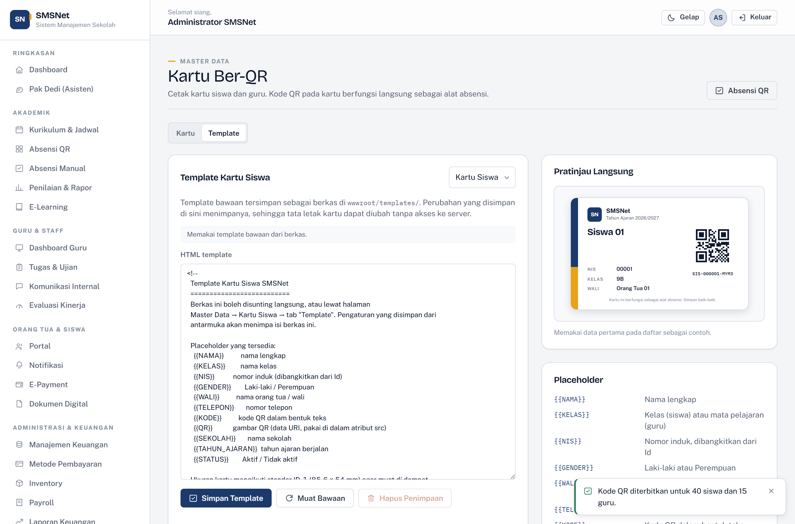

# QR Attendance & QR Cards

[← Back to documentation index](../README.md) · [Versi Bahasa Indonesia](../id/absensi-qr.md)

---


Every student and teacher gets a card carrying a QR code. The same card is both an
identity badge **and** the attendance token — no hardware beyond a phone camera or an
ordinary handheld scanner is required.

---

## The flow

```
1. Issue codes    →  Master Data → Kartu Ber-QR → "Terbitkan N kode QR"
2. Print cards    →  select students → Cetak
3. Take register  →  Akademik → Absensi QR → scan
```

---

## 1. Issuing codes

Open **Master Data → Kartu Ber-QR**. If anyone lacks a code, a button appears:
**"Terbitkan N kode QR"**. One click issues codes to everyone missing one.

The code shape:

```
SIS-000007-K4M9
│    │      └── 4 random characters
│    └───────── enrolment number
└────────────── SIS for students, GUR for teachers
```

**Why the random part?** So a student cannot guess a classmate's code from their
enrolment number alone. Without it, anyone who saw one card could derive the codes
for a whole year group.

The letters **I** and **O** and the digits **0** and **1** are excluded — they are the
characters most often misread when a code is typed by hand.

### Reissuing

The ⟳ button on each row issues a fresh code. **The old code stops working
immediately**, so a lost card cannot be used by anyone else. Reprint the card
afterwards.

---

## 2. Printing cards

Tick names in the table, then press **Cetak**. The preview below the table is exactly
what reaches the printer.

Cards use the **ID-1 standard (85.6 × 54 mm)** — the same size as a bank card, so they
fit a wallet and a standard badge holder. Two cards print per row on A4.

When printing, the sidebar and buttons are hidden automatically; only the card sheet
goes to the printer.

> **Note:** enable "Background graphics" in the browser's print dialog so the coloured
> spine on the card prints too.

---

## 3. Editing the card template



The card layout is **editable HTML**, in two places:

| Route | Location | When to use |
| --- | --- | --- |
| **File** | `wwwroot/templates/kartu-siswa.html` and `kartu-guru.html` | When you have server access |
| **Interface** | Master Data → Kartu Ber-QR → **Template** tab | When you do not |

A layout saved through the interface **overrides** the file. The **Hapus Penimpaan**
button removes the override and returns to the shipped file.

### Placeholders

| Token | Contents |
| --- | --- |
| `{{NAMA}}` | Full name |
| `{{KELAS}}` | Class (student) or subject (teacher) |
| `{{NIS}}` | Enrolment number |
| `{{GENDER}}` | Laki-laki / Perempuan |
| `{{WALI}}` | Guardian name (student) or email (teacher) |
| `{{TELEPON}}` | Phone number |
| `{{KODE}}` | The QR code as text |
| `{{QR}}` | The QR image — use inside a `src` attribute |
| `{{SEKOLAH}}` | School name |
| `{{TAHUN_AJARAN}}` | Current academic year |
| `{{STATUS}}` | Aktif / Tidak aktif |

The preview beside the editor updates as you type, using the first record in the list
as sample data.

### Security boundary

The template is sanitised before rendering. `script` tags, `iframe`s, and event
attributes are stripped — including ones pasted in by accident from a copied snippet.
Inline `style` is permitted, because a card layout genuinely needs it.

---

## 4. Taking the register


Open **Akademik → Absensi QR**. Two modes are available.

### Camera mode

Turns on the device camera and scans continuously. Suited to a phone or tablet held
by staff at the gate.

- Uses the browser's built-in **BarcodeDetector** where available (Chrome, Edge,
  Android) and falls back to **jsQR** elsewhere (Safari, Firefox). The engine in use
  is shown under the button.
- Beeps and vibrates on a successful read, so the operator does not have to watch the
  screen.
- A card held in front of the lens does **not** produce dozens of scans — the same
  code is ignored for 2.5 seconds.
- The camera is released when you navigate away, so its indicator light does not stay
  on.

> Camera access requires **HTTPS**, except on `localhost`. When the camera cannot be
> opened, the error message always points at the second mode.

### Scanner / manual mode

One input field serving two purposes:

- **A handheld scanner** (USB or Bluetooth) behaves like a keyboard — point it at the
  card and the code fills in and submits itself, because the device sends Enter. The
  field keeps its own focus, so the operator need not click it each time.
- **Typing by hand** for a damaged or forgotten card. Case, spaces, and hyphens are
  irrelevant — `sis 000007 k4m9` resolves the same as `SIS-000007-K4M9`.

### Three possible outcomes

| Outcome | Colour | Meaning |
| --- | --- | --- |
| **Tercatat** | Green | Attendance saved, with the time |
| **Sudah tercatat** | Amber | Card scanned twice — the first arrival time is shown |
| **Tidak dikenali** | Red | The code matches nobody |

**A second scan does not create a second record.** Cards get double-tapped constantly
at a school gate; if every tap added a row, every attendance percentage in the
application would be wrong.

---

## 5. Today's list

The right-hand panel lists everyone recorded today, newest first, with their
**arrival time**. A newly added row flashes briefly so the operator sees it land.

Available:

- **Name search** — filters as you type
- **Role filter** — students, teachers, or both
- **Undo** — a delete button per row, for a card scanned by the wrong person. Once
  removed, the same card can be scanned again.

Every scan and every undo is written to the **Audit Trail**.

---

## Relationship to manual attendance

QR attendance writes to the same table as **manual attendance**, with the Method column
set to `QR`. That means:

- Attendance summaries, academic reports, and the Parent Portal include it immediately
- The Pak Dedi assistant can answer questions about it through `rekap_absensi`
- The manual page remains the place to record sickness and excused absence, which do
  not involve scanning a card

---

## Troubleshooting

| Symptom | Cause | Fix |
| --- | --- | --- |
| No "issue codes" button | Everyone already has a code | Expected — nothing to do |
| Cards print without colour | The browser drops backgrounds when printing | Enable "Background graphics" in the print dialog |
| "Code not recognised" for a genuine card | The code was reissued | Reprint the card |
| Camera will not start | Not HTTPS, permission denied, or in use elsewhere | The error names the cause; use Scanner / manual mode |
| Handheld scanner types elsewhere | Focus moved away | The code field holds its own focus — click it once |
| Camera cannot read the QR | Card printed too small or blurred | Print at 100%, not "fit to page" |
