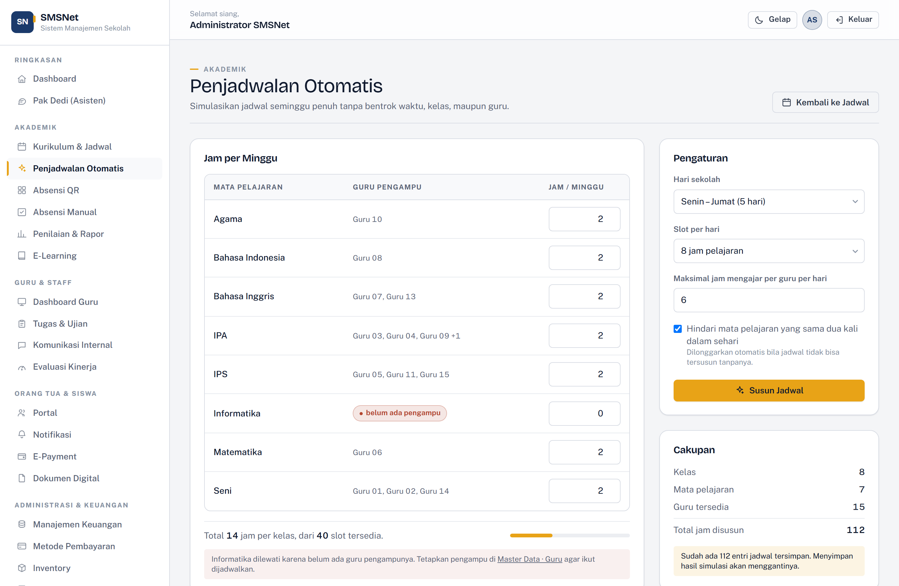
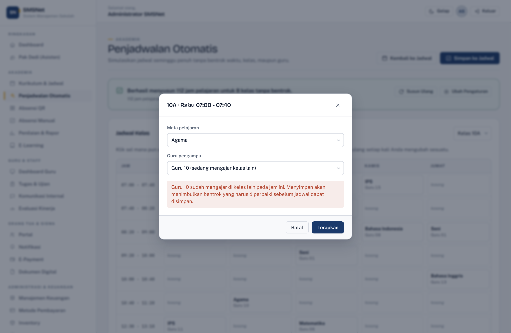

# Automatic Timetabling

[← Back to documentation index](../README.md) · [Versi Bahasa Indonesia](../id/penjadwalan.md)

---


Builds a full week of lessons for every class at once, without ever putting a teacher
in two classrooms at the same hour.

The page **simulates** a timetable. The result stays fully editable and does not touch
the database until you press **Simpan ke Jadwal** (Save to Schedule).

**Access:** Admin and Teacher. Reach it from **Akademik → Kurikulum & Jadwal →
Penjadwalan Otomatis**, or go straight to `/academic/schedule-generator`.

---

## At a Glance

```
1. Set weekly hours    →  "Jam per Minggu" table
2. Set days & slots    →  "Pengaturan" panel
3. Generate            →  simulation appears within seconds
4. Adjust if needed    →  click any cell
5. Save                →  replaces the existing timetable
```

---

## 1. Weekly Hours per Subject



The table on the left lists every subject with the teachers qualified to take it. The
**Jam / Minggu** column sets how many periods that subject gets in **each** class per
week.

The initial values come from the **Credits** field in Master Data → Subjects, so they
are usually right without any editing.

### Subjects with no teacher

A subject with no qualified teacher is badged **"belum ada pengampu"**, its hours input
is disabled, and the subject is **skipped** — a note under the table names them.

This is deliberate. A subject with no teacher cannot be placed at all; including it
would fail the whole run over a row you cannot fix from this page. Assign a teacher in
**Master Data → Guru**, then reload.

### Capacity meter

Under the table:

```
Total 14 jam per kelas, dari 40 slot tersedia.
```

The meter turns **red** when the requested hours exceed the available slots. When that
happens, reduce hours or add days/slots — generation cannot succeed.

---

## 2. Settings

| Setting | Options | Notes |
| --- | --- | --- |
| **School days** | 5 days (Mon–Fri) or 6 days (Mon–Sat) | |
| **Slots per day** | 6, 7, or 8 periods | Times follow a fixed list that includes breaks |
| **Max teaching periods per teacher per day** | number, default 6 | Stops one teacher carrying a whole day |
| **Avoid the same subject twice a day** | checkbox, default on | Spreads subjects across the week |

> "Avoid the same subject twice a day" is **relaxed automatically** if no timetable can
> be built with it. A slightly bunched timetable beats no timetable at all.

---

## 3. Generating

Press **Susun Jadwal**. Solving runs off the UI thread so the page stays responsive;
an 8-class school typically finishes in under 300 ms.

The summary card reports how many periods were placed, how many attempts it took, and
how long it ran.

### How it works

Timetabling is a **constraint satisfaction problem**, not a shuffle. The solver uses
the standard techniques:

| Technique | What it does |
| --- | --- |
| **Backtracking** | Places one period, and reverses out of dead ends |
| **MRV** (minimum remaining values) | Always takes the lesson with the fewest legal placements left, so failures surface early |
| **Forward checking** | Abandons a branch the moment any lesson loses all of its options |
| **Randomized restarts** | Retries from a fresh random point when an attempt stalls — up to 40 within an 8-second budget |

Hard constraints:

- one lesson per class per slot;
- one class per teacher per slot;
- teachers only get subjects they actually teach;
- no teacher exceeds the daily limit you set.

### When it cannot succeed

Impossible requests are **rejected before solving starts**, with a reason you can act
on — total hours exceeding available slots, or too few teachers for a subject.

If only part of the timetable fits, the best partial board is still shown, alongside a
**"Tidak Dapat Ditempatkan"** (Unplaceable) card naming each lesson that failed. Far
more useful than an empty page.

---

## 4. Editing the Result

The grid shows one class at a time; the picker at the top right switches classes.

**Click any cell** to open it:



- The teacher list only contains teachers qualified for the chosen subject.
- A teacher already teaching elsewhere at that hour is labelled
  **"(sedang mengajar kelas lain)"** — already teaching another class.
- Choosing a busy teacher raises a warning **before** you apply it.
- Pick **"— kosongkan —"** to clear the cell.

You are still **allowed** to create a clash — sometimes you need to, for instance while
rearranging several cells in sequence. What the app guarantees is that a clashing
timetable cannot be saved.

---

## 5. Conflicts


Every edit re-checks the whole board. Findings come in two kinds:

| Kind | Badge | Effect |
| --- | --- | --- |
| **Bentrok** (clash) | red | Blocks saving |
| **Catatan** (note) | amber | Informational only |

Blocking:

- one teacher in two classes at the same hour;
- one class with two lessons at the same hour;
- a teacher assigned a subject they do not teach;
- a lesson with no teacher;
- a teacher over the daily limit.

Non-blocking:

- a subject's period count differing from what was requested on the setup step.

Offending cells are **outlined in red** in the grid, so there is no need to reconcile
the findings list against the table by hand. **Simpan ke Jadwal** stays disabled while
any clash remains.

---

## 6. Saving

**Simpan ke Jadwal** asks for confirmation first, and states the numbers:

> Seluruh 12 entri jadwal yang tersimpan akan diganti dengan 112 entri hasil simulasi ini.
> *(All 12 stored schedule entries will be replaced by the 112 entries from this simulation.)*

**Saving replaces rather than merges.** A week's timetable is one coherent artefact;
merging a new week over an old one leaves orphaned lessons nobody asked for. That is
why the outgoing count is always named before you commit.

Once saved, the timetable appears under **Akademik → Kurikulum & Jadwal → Jadwal
Pelajaran**, and is picked up by the Teacher Dashboard, the Parent Portal, and the Pak
Dedi assistant. The action is recorded in the **Audit Trail**.

---

## Troubleshooting

| Symptom | Cause | Fix |
| --- | --- | --- |
| "Susun Jadwal" is disabled | No classes exist | Add classes in Master Data → Kelas |
| A subject never appears | It has no qualified teacher | Assign one in Master Data → Guru |
| Capacity meter is red | Requested hours exceed slots | Reduce hours, or add days/slots |
| "Tidak Dapat Ditempatkan" lists many lessons | Too few teachers for a subject | Add teachers, or raise the per-teacher daily limit |
| Many empty cells | Requested hours are simply below capacity | Expected — add hours for a fuller week |
| Save button is disabled | A clash remains | Fix the red-outlined cells, or press Susun Ulang |
| Different result each run | Solving is randomized by design | Press Susun Ulang until you get a shape you like |
