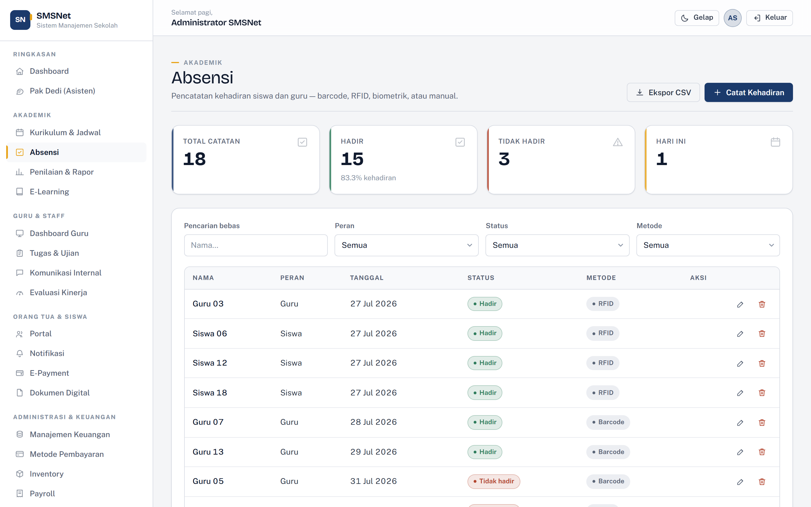
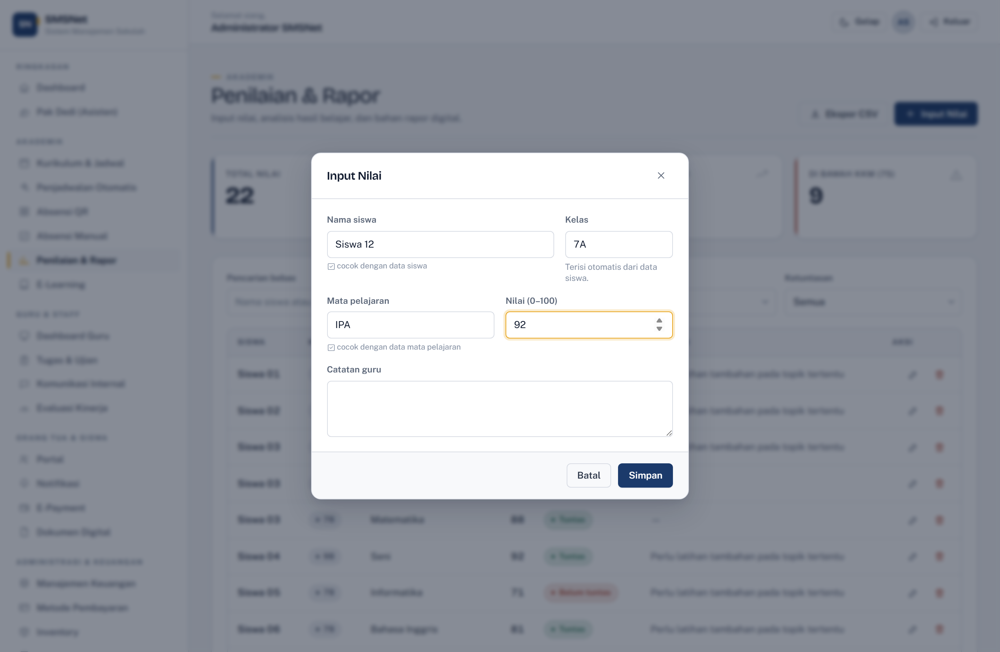
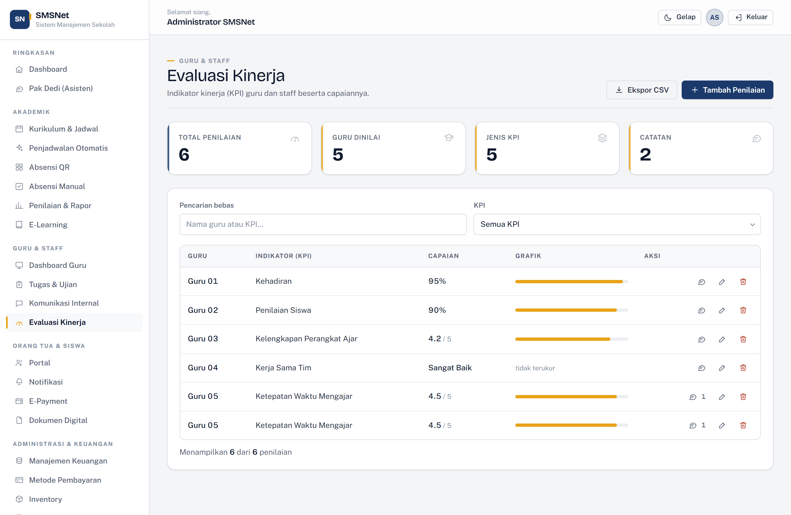
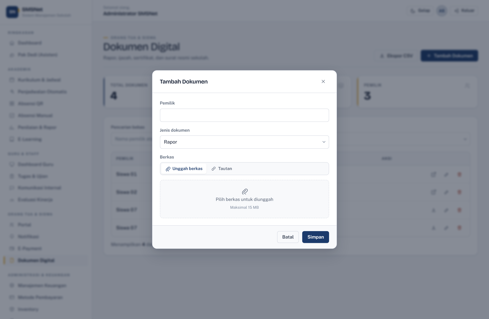

# Panduan Fitur

[← Kembali ke indeks dokumentasi](../README.md) · [English version](../en/features.md)

---

## Dashboard

Halaman pertama setelah masuk. Menampilkan empat angka kunci (siswa aktif, guru aktif,
kehadiran hari ini, tunggakan), tren kehadiran 14 hari, sebaran nilai, agenda mendatang,
dan notifikasi terbaru.

---

## Akademik

### Kurikulum & Jadwal

Dua tab dalam satu halaman:

- **Kurikulum** — daftar kurikulum yang berlaku beserta jenjang dan keterangannya.
- **Jadwal Pelajaran** — dikelompokkan per hari, dapat disaring menurut kelas dan hari.

### Penjadwalan Otomatis

Menyusun jadwal satu minggu penuh untuk seluruh kelas sekaligus, tanpa guru yang
terjadwal di dua kelas pada jam yang sama. Hasilnya berupa simulasi yang masih dapat
disunting per sel, dengan pemeriksaan bentrok setiap kali diubah, dan baru menyentuh
basis data setelah dikonfirmasi. Selengkapnya: [dokumen penjadwalan](penjadwalan.md).

### Absensi QR

Kartu ber-QR untuk siswa dan guru, dipakai langsung sebagai alat absensi.
Dua mode pemindaian: kamera perangkat, atau pemindai genggam / ketik manual.
Selengkapnya: [dokumen absensi QR](absensi-qr.md).

### Absensi

Pencatatan kehadiran siswa dan guru. Empat metode didukung: Barcode, RFID, Biometrik,
dan Manual. Status: Hadir, Tidak hadir, Sakit, Izin.

Tersedia pencarian bebas, saringan per peran/status/metode, pengurutan, paging, dan
ekspor CSV.

### Penilaian & Rapor

Input nilai per siswa per mata pelajaran, lengkap dengan catatan guru. Ketuntasan
dihitung terhadap KKM 75. Kartu ringkasan menampilkan rata-rata, nilai tertinggi, dan
jumlah siswa yang belum tuntas.

Nama siswa dan mata pelajaran diisi lewat **lookup** ke Master Data — mengetik akan
memunculkan saran, dan sebuah keterangan menyebutkan apakah nilai yang diketik cocok
dengan data yang ada. Memilih siswa **mengisi kelasnya secara otomatis**, dan kelas itu
**ikut tersimpan bersama nilai**.

> Kelas disimpan, bukan dibaca ulang dari data siswa saat ditampilkan. Sebuah nilai
> adalah catatan sebuah momen; membacanya dari data siswa akan diam-diam mengubah hasil
> tahun lalu begitu siswa naik kelas.

Nilai divalidasi pada rentang 0–100, dan dapat disaring per kelas.

### E-Learning

Modul, video, kuis, dan ujian daring. Siswa dapat membaca; hanya admin dan guru yang
dapat menambah atau mengubah.

Setiap materi dapat memuat **tautan** ke tempat materi itu sesungguhnya berada — video,
dokumen, atau formulir kuis. Tombol pembukanya menyesuaikan jenis materi ("Tonton",
"Kerjakan kuis", "Mulai ujian"), membuka di tab baru, dan hanya menerima alamat
`http`/`https`.

---

## Guru & Staff

### Dashboard Guru

Jadwal mengajar **hari ini** (dicocokkan dengan nama hari dalam Bahasa Indonesia),
tugas yang mendekati tenggat, rata-rata nilai per mata pelajaran, dan diskusi terbaru.

### Tugas & Ujian

Penjadwalan tugas, kuis, dan ujian. Kolom "Sisa Waktu" menghitung mundur dan berubah
warna saat mendekati atau melewati tenggat.

Setiap tugas dapat memuat **tautan opsional** ke soal atau formulirnya, dan ditujukan ke
**beberapa kelas sekaligus atau seluruh kelas**. Kelas dipilih lewat deretan tombol;
mengosongkannya berarti berlaku untuk semua kelas, dan tugas semacam itu tetap muncul
saat daftar disaring per kelas.

### Komunikasi Internal

Forum diskusi antar guru dan staff. Nama penulis terisi otomatis dari akun yang sedang
masuk.

Isi topik ditulis dengan **editor teks berformat**, dan setiap topik dapat
**dikomentari** — lengkap dengan lampiran berkas/gambar dan emoji. Komentar hanya dapat
dihapus oleh penulisnya sendiri atau oleh admin.

Selengkapnya: [dokumen editor, komentar & unggahan](kolaborasi.md).

### Evaluasi Kinerja

Indikator kinerja (KPI) per guru. Nama guru diisi lewat **lookup** ke data guru aktif,
dan indikatornya dapat dipilih dari **templat** yang tersedia atau ditulis bebas.

Capaian punya **satuan** yang harus dipilih:

| Satuan | Rentang | Bilah kemajuan |
| --- | --- | --- |
| Persen | 0–100 | ya |
| Skala | 0–5 | ya, diskalakan |
| Teks | bebas, maks. 40 karakter | tidak — ditandai "tidak terukur" |

> Satuan disimpan, bukan ditebak. Tanpa itu bilah kemajuan salah membaca: nilai "4.2"
> pada skala 0–5 sebelumnya digambar sebagai 4%, bukan 84%.

Setiap indikator dapat **dikomentari** secara terpisah, dengan aturan hapus yang sama.

---

## Orang Tua & Siswa

### Portal Orang Tua

Pilih seorang siswa, lalu lihat dalam satu halaman: tingkat kehadiran (dalam bentuk
gauge), rata-rata nilai, rincian nilai per mata pelajaran, dan seluruh tagihannya.

### Notifikasi

Pengumuman sekolah dengan sasaran tertentu (Semua, Siswa, Guru, Orang Tua).
Notifikasi hari ini diberi penanda khusus.

### E-Payment

Lihat [dokumen pembayaran](pembayaran.md).

### Dokumen Digital

Rapor, ijazah, sertifikat, dan surat resmi. Semua peran keluarga dapat mengunduh;
hanya admin yang dapat mengelola.

Dokumen dapat **diunggah langsung** ke server sekolah, atau dicatat sebagai **tautan**
ke layanan lain. Keduanya ditandai dengan ikon berbeda, dan menghapus catatan hanya
menghapus berkas fisik bila memang aplikasi ini yang menyimpannya.

Selengkapnya: [dokumen editor, komentar & unggahan](kolaborasi.md).

---

## Administrasi & Keuangan

### Manajemen Keuangan

Pencatatan SPP, buku, kegiatan, seragam, dan denda. Menampilkan total tagihan,
jumlah lunas, tunggakan, dan tingkat penagihan.

### Metode Pembayaran

Lihat [dokumen pembayaran](pembayaran.md).

### Inventory

Aset sekolah dengan kategori dan kondisi (Baik, Cukup, Rusak).

### Payroll

Penggajian guru dan staff per periode.

### Laporan Keuangan Periode

Rekapitulasi pendapatan dan pengeluaran per periode, lengkap dengan surplus.

---

## Analitik & Laporan

### Dashboard Analitik

Empat grafik: tren kehadiran 30 hari, komposisi status pembayaran, sebaran siswa per
kelas, dan metode absensi yang dipakai.

### Data Analytics

Indikator operasional dengan interpretasinya — rasio siswa terhadap guru, keterisian
kelas, ketuntasan nilai, tagihan tertunggak, tugas aktif, dan kondisi aset. Setiap
indikator disertai penilaian singkat, bukan sekadar angka.

### Custom Reports

Pilih salah satu dari delapan sumber data, saring barisnya, lalu unduh sebagai CSV.

### Laporan Akademik

Gauge kehadiran, distribusi nilai, dan ringkasan per mata pelajaran dengan tingkat
ketuntasan masing-masing.

### Laporan Guru & Staff

Beban mengajar per guru, kehadiran, dan capaian KPI.

### Laporan Orang Tua & Siswa

Menyoroti siswa yang **perlu perhatian** — menunggak pembayaran atau nilainya di bawah
KKM — beserta alasannya.

### Laporan Master Data

Kelengkapan setiap tabel induk, ditambah **pemeriksaan konsistensi**. Karena relasi
disimpan sebagai nama dan bukan foreign key, basis data tidak dapat menjaga
integritasnya sendiri; halaman ini yang melakukannya:

- Siswa menunjuk kelas yang tidak terdaftar
- Jadwal menunjuk guru, mata pelajaran, atau kelas yang tidak terdaftar
- Kelas melebihi daya tampung
- Siswa tanpa nomor telepon

---

## Master Data

Empat halaman dengan pola yang sama: **Siswa, Guru, Mata Pelajaran, Kelas**.

Setiap halaman memiliki:

- Kartu ringkasan di bagian atas
- Pencarian teks bebas
- Saringan per kolom
- Pengurutan dengan mengklik judul kolom
- Paging 10 baris per halaman
- Ekspor CSV (dengan BOM, agar Excel membaca huruf beraksen dengan benar)
- Formulir tambah/ubah dalam dialog
- **Konfirmasi sebelum menghapus**

Khusus halaman Kelas, keterisian dihitung dari jumlah siswa aktif yang nama kelasnya
cocok, dan ditampilkan sebagai bilah kemajuan.

---

## Kegiatan

Event dan ekstrakurikuler dalam bentuk daftar berkalender. Kegiatan yang sudah lewat
ditampilkan lebih redup. Saringan bawaan menampilkan yang akan datang.

---

## Keamanan & Integrasi

### Role Access

Lihat [dokumen RBAC](rbac.md).

### Audit Trail

Setiap penambahan, perubahan, dan penghapusan tercatat lengkap dengan pelaku dan waktu.
Dapat disaring per pelaku dan diekspor ke CSV.

### REST API

Lihat [dokumen API](api.md).

---

## Pak Dedi

Lihat [dokumen asisten](asisten.md).

---

## Yang Berlaku di Seluruh Aplikasi

| Fitur | Keterangan |
| --- | --- |
| Tema terang/gelap | Ditentukan sebelum halaman digambar, sehingga tidak berkedip. Mengikuti preferensi sistem sampai pengguna memilih sendiri. |
| Responsif | Sidebar menjadi laci geser di bawah 1024px. Tabel bergulir dalam wadahnya sendiri sehingga halaman tidak pernah bergeser ke samping. |
| Konfirmasi hapus | Setiap penghapusan melewati dialog konfirmasi yang menyebut nama data yang akan dihapus. |
| Notifikasi ringkas | Umpan balik muncul sebagai toast di pojok kanan bawah. |
| Ekspor CSV | Memakai BOM UTF-8 agar Excel tidak merusak nama beraksen. |
| Cetak | Halaman laporan menyembunyikan sidebar dan tombol saat dicetak. |
| Gerak yang santun | Seluruh animasi tunduk pada `prefers-reduced-motion`. |
| Aksesibilitas | Cincin fokus kuning yang jelas pada setiap elemen interaktif; label pada seluruh isian. |
